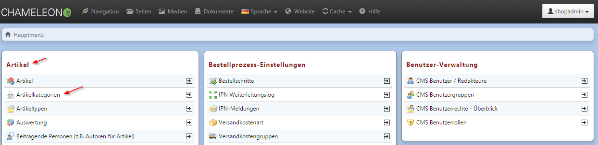

# 5 Backend                                         

Anwender sollten mit individuellen Zugängen Arbeiten am Backend vornehmen, da ein paralleles Arbeiten mit demselben Zugang nicht möglich ist (automatischer Logout der „älteren“ Session).
Menüpunkte im Backend werden in dieser Dokumentation wie folgt aufgeführt:
Artikel → Artikelkategorien

Zahlreiche Hilfestellungen finden Sie in der kontextsensitiven Hilfe, gekennzeichnet durch .

