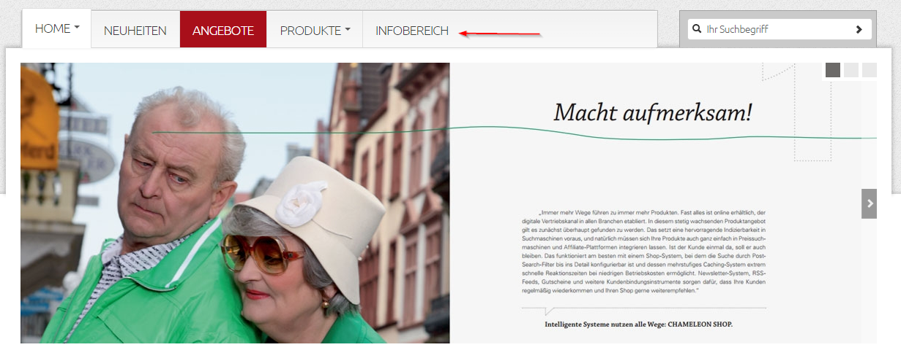

# Anzeige Shop-Hauptnavigation

*Website → Shop Main Navigation*

You can manage the display of the shop navigation via this menu button. 

~~Sie können beliebige Menüpunkte hinzufügen oder bestehende ändern. Ein Menüpunkt kann entweder mit einer Seite oder auch mit einer Artikelkategorie verknüpft werden.~~

You can create any menu point or edit existing ones. You can link a menu point either to a page nor to an article category. 

 

| Bezeichnung | Beschreibung |
| -- | -- |
| **Gehört zum Portal** | Wählen Sie den Name des Portals aus (sofern Sie mehrere Portale im CMS verwalten). |
| **Name** | Der Name des Menüpunktes, wie er im Frontend erscheinen soll. |
| **Gehört zu diesem Brand-Store** | Falls Ihr Shop Brand-Stores verwendet, wählen Sie den entsprechenden aus (so können Sie z.B. Artikel aus Brand-Stores für den Kunden schnell erreichbar zur Verfügung stellen). |
| **Aktiv** | Aktiviert den Menüpunkt |
| **Position** | Die angezeigte Reihenfolge können Sie hier verändern. |
| **Navigation aus** | Wählen Sie hier aus, ob der Menüpunkt mit einer Seite oder einer Produktkategorie verknüpft werden soll. |
| **Untermenü durch Shop-Hauptkategorien ersetzen** | Jeder Menüpunkt kann weitere Unterpunkte haben. Bei JA werden hier die Hauptkategorien des Shops (*Artikel → Artikelkategorien*) automatisch als Untermenü hinzugefügt. |
| **Eigene CSS-Klasse** | Hier kann eine CSS-Klasse definiert werden, die dann auf den Navigationspunkt angewendet wird. Standardmäßig kann „onSale“ für Angebote verwendet werden (der Menüpunkt wird dann in einer hervorgehobenen Farbe angezeigt). |
