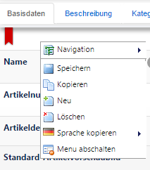

# Article

*Article → Article*

~~In der Artikelverwaltung sind alle im Shop verfügbaren Artikel aufgelistet. Die Suchfunktion ermöglicht ein schnelles Auffinden des gesuchten Artikels. Die Artikel gelangen entweder per Import in den Shop oder werden manuell angelegt.~~

Every available article is listed in the article administration. Using the search function you can easily find the product, you are looking for. The articles are created either via import or manual. 

 

#### Basic Data

~~| Beschreibung | Bezeichnung | erforderlich |
| -- | -- | -- |
| **Name** | Benennung des Artikels. Der Name ist erforderlich, um den Artikel im CMS-Backend finden zu können. | ja |
| **Artikelnummer** | Die eindeutige Nummer des Artikels im Shop | nein |
| **Artikeldetailbilder** | Bilder des Artikels. Wenn keine Artikelvorschaubilder definiert sind, wird das erste Bild aus dieser Liste als Standardvorschaubild verwendet. | nein |
| **Standard-Artikelvorschaubilder** | Das Hauptbild des Artikels (wird in den Kategorien angezeigt) | nein |
| **Artikelvorschaubilder** | Da ein Artikel im Shop an vielen Stellen unterschiedlich präsentiert werden kann, ist hier die Möglichkeit geboten, die jeweiligen Vorschaubilder definieren zu können. Ist hier kein Bild für die passende Vorschaugröße definiert, so wird das erste Bild aus den Artikelvorschaubildern verwendet. | nein |
| **Artikeldokumente** | Hier werden die zum Artikel passenden Dokumente zugewiesen (z. B Benutzerhandbuch, technische Beschreibung usw.). | nein |
| **Erstellt am** | Erstellungsdatum / Anlagedatum | nein |
| **Aktiv** | Inaktive Artikel werden im Shop nicht angezeigt. | ja |
| **Tags / Schlagworte** | Wird auf der Artikeldetailseite ausgegeben. Artikel mit gleichen Tags können so in einer Artikelliste ausgegeben werden. | nein |~~

| Designation | Description | required |
| -- | -- | -- |
| **Name** | Name of the article. The name is required to find the article in the CMS backend. | yes |
| **Article Number** | The unique number of the article | no |
| **Detailed Images of the article** | Images of the article. The first image of the list will be used as a standard preview image if there is nothing else defined.  | no |
| **Article Default Preview Images** | Main image of the article (displayed within the categories) | no |
| **Article Preview Images** | In here you can define the individual preview images, because it is possible to present the article in different ways and different points in your shop. The first of the article preview images will be used if there is nothing else defined for a matching preview size. | no |
| **Article Documents** | In here the relevant documents are assigned to the articles (for example  the user guide, the technical descriptions etc.) | no |
| **Date of Creation** | On which date the article was created. | no |
| **Active** | Non active articles will not be displayed in the shop. | yes |
| **Tags / Keywords** | Displayed in the article detail page. Articles with the same tag can be displayed within a list. | no |

 

#### Description

| Bezeichnung | Beschreibung | erforderlich |
| -- | -- | -- |
| **Kurzbeschreibung** | Eine kurze Zusammenfassung, die den Artikel möglichst treffend beschreibt. Die Anzeige der Kurzbeschreibung ist abhängig vom gewählten Seitentemplate (View), gewöhnlich wird sie in der Artikelliste mit aufegführt. | nein |
| **Beschreibung** | Ausführliche Beschreibung des Artikels auf der Artikeldetailseite | nein |

| Designation | Description | required |
| -- | -- | -- |
| **Short Description** | Short and abt summary of the article. If the shrort description is displayed or not depends on the selected page template (view).Eine kurze Zusammenfassung, die den Artikel möglichst treffend beschreibt. Die Anzeige der Kurzbeschreibung ist abhängig vom gewählten Seitentemplate (View), gewöhnlich wird sie in der Artikelliste mit aufegführt. | nein |
| **Beschreibung** | Ausführliche Beschreibung des Artikels auf der Artikeldetailseite | nein |

 

#### Kategorie / Merkmale

| Bezeichnung | Beschreibung | erforderlich |
| -- | -- | -- |
| **Hersteller / Marke** | Artikelhersteller oder Marke | nein |
| **Warengruppen** | Dienen der Gruppierung der Artikel. Warengruppen selbst können z.B. als Einschränkung bei Zahlmethoden verwendet werden. Die Zahlmethode wäre im Warenkorb nur dann verfügbar, wenn alle Artikel des Warenkorbes mindestens in einer Warengruppe sind.Warengruppen können entweder hier, direkt beim Artikel, angelegt werden oder über *Artikel → Warengruppen*, die Warengruppe wird dann beim Artikel verknüpft (AUSWÄHLEN). | nein |
| **Artikeltyp** | Ein Artikel kann einem oder mehreren frei definierbaren Artikeltypen zugewiesen werden (CD, Download, Produkt usw.). Artikeltypen können z.B. für Suchfilter sowie im Warenkorb zur Anwendung kommen (Downloads z.B. haben keine Versandkosten). | nein |
| **Produktkategorien** | Jeder Artikel kann einer (oder auch mehreren) Kategorie(n) zugewiesen werden und wird dann in der Artikelliste der jeweiligen Kategorie angezeigt. | ja |
| **Hauptkategorie des Artikels** | Befindet man sich gerade nicht auf einer Kategorieseite, welcher der Artikel zugewiesen ist, so wird als Standard die Hauptkategorie zur Generierung der Artikel-URL verwendet. | nein |
| **Artikelmerkmale** | Artikelmerkmale sind Beschreibungen, die den Artikeln zugefügt werden können. Diese Beschreibungen machen eine klare Aussage über den Artikel, z.B. “ist abwaschbar” oder „Blauer Engel“. Für jedes Merkmal kann ein Name, eine Beschreibung sowie ein Icon hinterlegt werden. | nein |
| **Produktattribute** | Produktattribute sind Merkmale, denen unterschiedliche Werte zugewiesen werden können, z.B. “waschbar bei” + zugehöriger Wert “30°C”. Ohne Zuweisung eines Wertes ist dieses Attribut aussagelos. | nein |
| **Auf folgende Shops einschränken** | Falls im System mehrere Shops existieren, kann hier eine Einschränkung der Artikelsichtbarkeit vorgenommen werden. | nein |
| **Zum Arktikel beitragende Personen** | Hier werden Personen oder Firmen hinterlegt, die in die Produktion des Artikels involviert waren (z.B. als Autor oder Sprecher). Die Anzeige ist abhängig vom gewählten Seitentemplate. | nein |
| **Download-Datei** | Hier können Sie diesem Artikel einen Download aus der Dokumentenverwaltung zuweisen. Diese Datei kann vom User erst heruntergeladen werden, wenn der Artikel erfolgreich gekauft wurde. **<u>Wichtig</u>**:Da diese Funktion auch bei Produkten zur Verfügung steht, die nicht explizit als "Download" definiert wurden (z.B. über die Zuweisung eines Lagers namens "Download"), können hier auch sonstige für den Artikel relevanten Files hinterlegt werden - z.B. Firmware-Upgrades für Hardware etc. | nein |

 

#### Preis / Versand

| Bezeichnung | Beschreibung | erforderlich |
| -- | -- | -- |
| **Preis** | Artikel-Brutto-Preis | ja |
| **Vergleichspreis** | Der Vergleichspreis (UVP) des Artikels (wird für gewöhnlich im Shop durchgestrichen angezeigt, da höher als der eigentliche Preis) | nein |
| **Umsatzsteuergruppe** | Zum Artikel passender Umsatzsteuersatz | nein |
| **Artikel ist versandkostenfrei** | Identifiziert Artikel, die versandkostenfrei versendet werden. | nein |
| **keine Gutscheine zulassen** | JA: im Warenkorb angewendeten Gutscheine wirken sich nicht auf dieses Produkt aus. | nein |
| **keine Rabatte zulassen** | JA: Rabatte werden nicht auf dieses Produkt angewendet. | nein |

 

#### Inhalt / Maße / Gewicht

Unter *Inhalt / Maße / Gewicht* können die entsprechenden Angaben zu den Dimensionen des Artikels angegeben werden.

Möchten Sie Grundpreise in Ihrem Shop angeben (z.B. 100g / 5,73 €), hinterlegen Sie die Angaben in den Feldern **Inhalt** (Mengenangabe) und **Maßeinheit des Inhalts** (kg, g, l, ml, usw.).

Die Maßeinheiten selbst können über das CMS erweitert werden (sh. Kapitel **3.4 Maßeinheiten**).

 

#### Varianten

Varianten eines Artikels, wie z.B. verschiedene Größen und/oder Farben bei Bekleidung, können mithilfe des Variantengenerators erzeugt werden, sh. Kap. **4.8 Artikelvarianten**.

 

####Lager

| Bezeichnung | Beschreibung | erforderlich |
| -- | -- | -- |
| **Lagerbestand** | Auf Lager, verfügbare Artikelanzahl | nein |
| **Bei 0 Bestand Vormerken anbieten** | Sinkt der Bestand auf „0“, wird ein Formular zum Vormerken des Artikels auf der Artikeldetailseite angezeigt. | nein |
| **Lieferstatus** | Ein meist vom Shopbetreiber vorgegebener Status wie „nicht lieferbar“ oder „sofort lieferbar“, der auf der Artikeldetailseite angezeigt werden kann. Im Datensatz des Lieferstatus (Lagerbestandsmeldung) kann definiert werden, ob der Artikel automatisch deaktiviert werden soll, wenn der Bestand 0 ist. Bei NEIN ist der Artikel also immer noch sichtbar, auch wenn der Bestand ≤0 ist. | nein |

 

#### Cross Selling

Im Bereich Cross Selling können mit dem Artikel verwandte Artikel (ähnliche Artikel) verknüpft werden und das Zubehör des Artikels zugewiesen werden. Diese Verknüpfungen werden je nach Shop-Design zur Verkaufsförderung verwendet und werden bei der Ansicht des Artikels mit angezeigt (sh. auch Kapitel **4.9 Produktlisten**).

 

#### SEO / Meta

| Bezeichnung | Beschreibung | erforderlich |
| -- | -- | -- |
| **SEO Pattern** | Durch die Definition des SEO-Patterns kann genau gesteuert werden, wie der Titel der Artikelseite aussehen soll. **<u>Zur Verfügung stehen</u>**: [{PORTAL_NAME}] - Name des Portals; [{CATEGORY_NAME}] – Kategorie-Name; [{MANUFACTURER_NAME}] – Hersteller-Name; [{ARTICLE_NAME}] - Artikelbezeichnung; [{SHOW}] – zeigt alle Möglichkeiten an; *Wird hier nichts eingetragen, greifen die allgemeinen Einstellungen unter Portale/Webseiten* | nein |
| **Meta-Schlüsselwörter** | Hier werden die Suchmaschinen-relevanten Meta-Schlüsselwörter (meta keywords) hinterlegt.Wird dieses Feld leer gelassen, verwendet der Shop die Kurzbeschreibung des Artikels. | nein |
| **Meta-Description** | Optionale Meta-Beschreibung (description) für die Artikelseite. Wird kein Wert hinterlegt, erstellt das System eine Meta-Beschreibung auf Basis der Artikeldaten. Die Description wird als erläuternder Text bei den trefferlisten in Suchmaschinen angezeigt. | nein |

Unter „Metadaten“ können die Metadaten speziell für dieses Produkt überschrieben werden.

 

#### Suche

| Bezeichnung | Beschreibung | erforderlich |
| -- | -- | -- |
| **Gewichtung des Artikels** | Zahl, über die der Rang des Produktes in den Listen gesteuert werden kann. | nein |
| **Virtueller Artikel** | Identifiziert den Artikel als virtuell (real nicht verfügbar). Ein Beispiel für einen virtuellen Artikel könnte ein eBook-Download beim Kauf eines Buches sein. | nein |
| **Ist suchbar** | Definiert, ob der Artikel in den Suchindex aufgenommen wird. | nein |
| **Als neu kennzeichnen** | Optionale Einstellung, die im Design ausgewiesen wird. | nein |

 

#### Bewertungen

| Bezeichnung | Beschreibung | erforderlich |
| -- | -- | -- |
| **Anzahl Sterne** | Gibt die durchschnittliche Benutzerbewertung des Produktes an | nein |
| **Kundenrezessionen** | Alle von den Kunden geschriebenen Rezensionen. Je nach Konfiguration | nein |

 

#### Bundle

| Bezeichnung | Beschreibung | erforderlich |
| -- | -- | -- |
| **Ist ein Bundle** | Bundles werden als echtes Produkt im Shop geführt. Hier muss also eine eigene Beschreibung, eigene Bilder, ein eigener Preis, usw. hinterlegt werden. Um das Bundle als solches zu erkennen, wird das Produkt über „Ist ein Bundle“ als Bundle markiert. Zusätzlich werden alle zu dem Bundle gehörenden Produkte dem Bundle zugewiesen. Bei der Zuweisung jedes Artikels kann die Stückzahl mit angegeben werden. Im Warenkorb und bei allen Berechnungen wird das Bundle ebenfalls als ein Produkt behandelt. | nein |
| **Artikel, die zu diesem Bundle gehören** | Wenn es sich um ein Bundle handelt, können hier die zu dem Bundle gehörenden Produkte hinterlegt werden. **<u>Wichtig</u>**: Alle dem Bundle zugewiesenen Produkte werden dabei ignoriert. Rabatte, Gutscheine, Zahlmethoden, Versandkosten und Mehrwertsteuerregeln gelten also nie für die einzelnen Produkte in dem Bundle, sondern immer nur für das Bundle-Produkt. | nein |

 

#### Stats

Liefert eine statistische Kurzübersicht über den Artikel (Verkäufe, Detailaufrufe, durchschnittliche Bewertung, Anzahl der Bewertungen).

Ihre Eingaben speichern Sie über den SPEICHERN-Button oberhalb des Datensatzes oder auch noch bequemer, über Rechtsklick an jeder beliebigen Stelle im Datensatz erreichen Sie das Kontextmenü, welches Ihnen die wichtigsten Editierfunktionen.

| Bezeichnung |Beschreibung |
| -- | -- |
| **Speichern** | Nach erfolgreicher Plausibilitätsprüfung wird der Artikel gespeichert |
| **Kopieren** | Kopiert die Artikeldaten und erstellt einen neuen Artikel |
| **Neu** | Erstellt einen neuen leeren Artikel |
| **Löschen** | Löscht den Artikel |
| **Sprache kopieren** | Felder, die in der aktuellen Sprache nicht übersetzt sind, können aus einer anderen Sprache kopiert werden. Wenn man sich z.B. in der Editiersprache Englisch befindet, kann man so den deutschen Text erst einmal in dieses Feld kopieren, um es zum jetzigen (oder auch späteren) Zeitpunkt zu übersetzen.  |
| **Menü abschalten** | Schaltet bis zum nächsten Seiten-Reload das CHAMELEON-Kontextmenü auf dem rechten Mausklick ab, damit das Standardmenü des Browsers durch Rechtsklick verwendet werden kann. |

