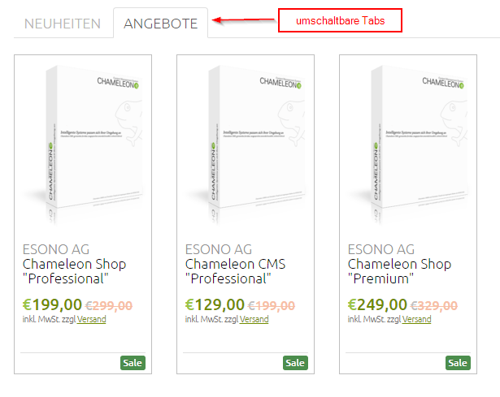
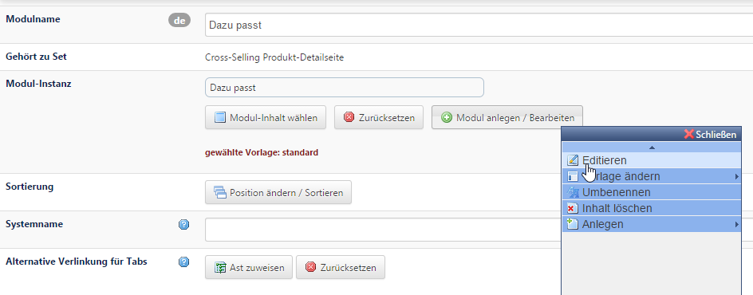

# Artikellisten mit dem Multimodul anlegen

Mit dem Multimodul können in einem Steckplatz mehrere Module platziert und somit Modul-Kollektionen vorkonfiguriert werden, die auf beliebigen Seiten einsetzbar sind. So können z.B. mehrere Artikellisten an einer Stelle auf der Seite platziert werden, die durch umschaltbare Tabs erreichbar sind.

In den Multimodul-Sets sind bereits angelegte Listen verfügbar (Cross-Selling auf der Produktdetailseite und auf Kategorieseiten sowie auf der Startseite). Hier können auch neue Sets angelegt oder bestehenden Sets weitere Tabs hinzugefügt werden.
Möchten Sie z.B. auf der Produktdetailseite weitere Listen wie „Dazu passt“ oder „Zubehör“ anzeigen lassen, dann fügen Sie im Multimodul-Set „Cross-Selling Produktdetailseite“ ein ***Set bestehend aus folgenden Modulen*** hinzu. Wählen Sie über *Modul anlegen* / *bearbeiten* das Modul *Produktliste* (standard) aus. Die Filtereinstellungen können Sie nun über *Editieren* bearbeiten.

**Achtung**: Die Artikel, die in den Cross-Selling-Listen *Zubehör* und *Ähnliche Artikel* („Dazu passt“) erscheinen sollen, werden beim Artikel selbst im Tab Cross Selling hinterlegt. 
Die Reihenfolge der umschaltbaren Tabs wird über den Button ***Sortierung*** im Multimodul-Set gesteuert.

