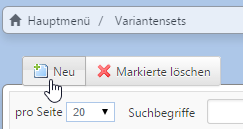

# Artikelmerkmale

#### Inhalt

[4.7.1 Artikelvarianten](artikelvarianten.md)

[4.7.2 Produktlisten](produktlisten.md)

[4.7.3 Presenter mit verlinkbaren Hotspots (Modul)](presenter_mit_verlinkbaren_hotspots_modul.md)    

*Artikel → Shop-Artikelmerkmale ***   

Für jedes Merkmal kann Name Beschreibung sowie Icon hinterlegt werden. Hierbei handelt es sich nicht um Produktattribute, d.h. es können <u>keine Werte</u> je Merkmal pro Artikel zugewiesen werden. Artikelmerkmale sind z.B. CE-geprüft, TÜV-geprüft, spülmaschinenfest, Batterien incl., Full-HD usw..

Die Artikelmerkmale können im Artikel im Tab Kategorie/Merkmale mit dem Artikel verknüpft werden und werden im Shop auf der Artikeldetailseite angezeigt.

