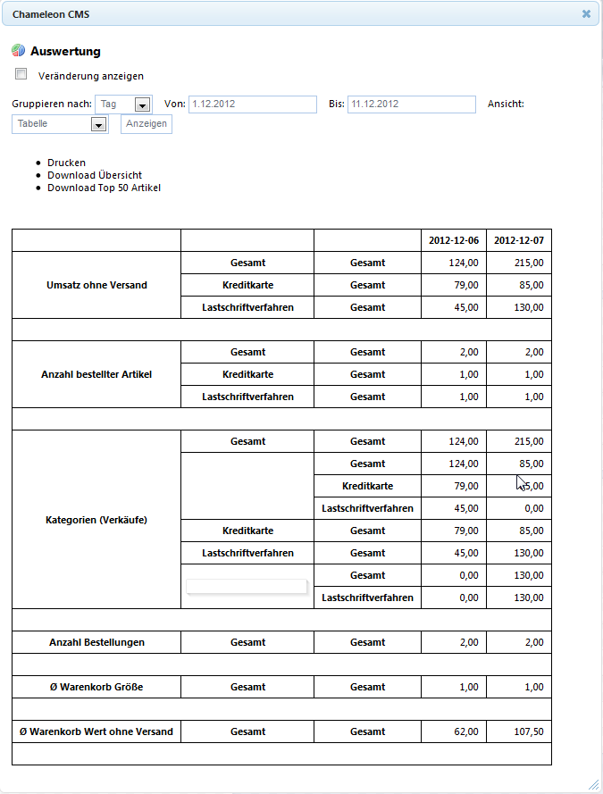

# Auswertung (Chameleon intern)

Artikel → Auswertung

Die CHAMELEON-interne Auswertung zeigt eine Grobübersicht aller Bestellungen im Shop. Dabei hat man die Möglichkeit, die Auswertungen nach Jahr, Tag, Monat oder Woche zu gruppieren oder durch einen Zeitraum zu beschränken. Außerdem kann die Auswertung selbst in einer Tabellenansicht (s.u.) oder als Balkendiagramm ausgegeben werden.

Bei eingeschalteter „Veränderung anzeigen“ -Option enthält die Auswertung eine weitere Spalte, die durch das Symbol „Δ“ im Spaltenkopf dargestellt ist. Diese Spalte zeigt die jeweilige Veränderung zur ausgewählten Vor-Zeitperiode.

Des Weiteren bietet die CHAMELEON-interne Auswertung alle wichtigen Daten einer Auswertung auch als CSV-Datei zum Download an und ermöglicht somit die Weiterverarbeitung dieser.

Eine Druckfunktion zur Ausgabe der im Browser sichtbaren Auswertungen ist ebenfalls vorhanden. Weiterhin können Sie sich die gesamte Statistik oder die Top 50 Artikel als csv-Datei downloaden.

