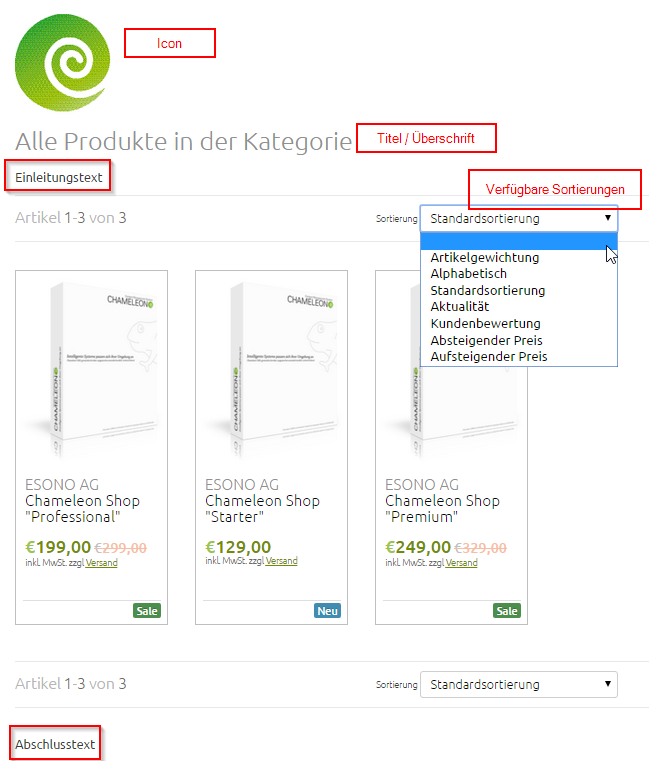

# Automatische Artikelliste anlegen (Modul Produktliste)

Legen Sie auf der Seite, auf der die automatische Artikelliste erscheinen soll, das Modul **Produktliste** an.

### Basisdaten

| Bezeichnung | Beschreibung |
| -- | -- |
| **Titel / Überschrift** | Der Titel wird über der Liste angezeigt. |
| **Icon** | Das Icon wird über dem Titel angezeigt.|
| **Filter / Inhalt** | Hier wird der Filter für die anzuzeigende Liste ausgewählt. Sie haben die Möglichkeit, aus vielen vorkonfigurierten Filtern auszuwählen. Bei manueller Selektion werden die Artikel im 2. Tab „Alternativselektion…“ bestimmt. |
| **Sortierung** | Hier wird die Sortierung bestimmt, anhand derer die Artikel beim Aufruf der Seite angezeigt werden. |
| **Verfügbare Sortierungen** | Hier kann ausgewählt werden, welche Sortierungen bei der Anzeige überhaupt zur Verfügung stehen sollen.  |
| **Beschränkung der Artikelanzahl** | Über dieses Feld kann festgelegt werden, wie viele Artikel insgesamt angezeigt werden dürfen. Um alle Artikel anzuzeigen muss hier -1 hinterlegt werden. |
| **Anzahl der Artikel pro Seite** | Über dieses Feld lässt sich die Seitengröße bestimmen. Um alle Artikel auf einer Seite darzustellen, kann hier einfach -1 hinterlegt werden.|
| **Einleitungstext** | Der optionale Einleitungstext wird gewöhnlich am Anfang der Liste, direkt nach der Überschrift angezeigt. |
| **Abschlusstext** | Der optionale Abschlusstext wird gewöhnlich am Ende der Liste angezeigt. |

Möchten Sie manuell ausgewählte Produkte anzeigen lassen, wählen Sie bei **Filter** / **Inhalt** „Manuelle Selektion“. Im Tab Über die Alternativselektion kann definiert werden, wie sich die Liste verhalten soll, wenn der gewählte Filter keine Ergebnisse bringt können Sie entweder Artikel aus bestimmten Warengruppen oder Produktkategorien anzeigen lassen oder auch einzeln selektierte Artikel. Diese Auswahl können Sie auch treffen, wenn Sie z.B. eine Filter gewählt haben, der keine Ergebnisse bringt wie „Zuletzt angeschaut“.

Im Tab Filter kann bestimmt werden, ob die Artikelliste durch einen Shop-Listenfilter weiter eingeschränkt werden soll (anzulegen in einem 2. Steckplatz auf der Seite). Es kann immer nur eine Liste auf der Seite für diesen Filter freigegeben werden.