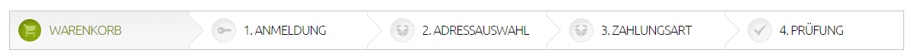

# Bestellschritte (Checkout)

Bestellprozess-Einstellungen → Bestellschritte

Während der Bestellung durchläuft der Käufer alle zur Bestellung nötigen Schritte. In den Bestellschritten werden alle für einen erfolgreichen Abschluss der Bestellung benötigten Daten zusammengestellt.

Die Bestellschritte können Sie je nach Anforderung Ihres Shops selbst definieren.
Beispiel eines Bestellprozesses (auch Checkout genannt):

Darstellung im Frontend:

