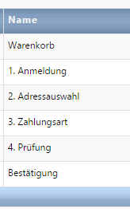

# Bestellschritte (Checkout)

*Bestellprozess-Einstellungen → Bestellschritte*

Während der Bestellung durchläuft der Käufer alle zur Bestellung nötigen Schritte. In den Bestellschritten werden alle für einen erfolgreichen Abschluss der Bestellung benötigten Daten zusammengestellt.

Die Bestellschritte können Sie je nach Anforderung Ihres Shops selbst definieren.
Beispiel eines Bestellprozesses (auch Checkout genannt):

Darstellung im Frontend:

Einstellung im Backend:

Für die einzelnen Schritte können Sie einen Namen und eine Beschreibung und festlegen, ob die Schritte in der Navigationsleiste auf der Seite angezeigt werden sollen (sh. Abbildung oben Frontend). Sie können auch eine bestimmte Vorlage für die Ansicht im Frontend hinterlegen.

| Bezeichnung | Beschreibung |
| -- | -- |
| **Warenkorb** | Erster Schritt, in welchem der Kunde die Möglichkeit hat, den zusammengestellten Warenkorb zu prüfen und zu ergänzen. |
| **1. Anmeldung** | In diesem Schritt hat der Kunde die Möglichkeit, sich als Neukunde zu registrieren oder sich im Shop anzumelden (falls bereits registriert) oder auch als Gast zu bestellen (optional).|
| **2. Adressauswahl** | In diesem Schritt kann der Kunde eine von der Rechnungsanschrift abweichende Lieferanschrift oder auch eine neue Rechnungsadresse angeben. Weiterhin ist hier die Auswahl eine Packstation möglich. |
| **3. Zahlungsart** | Auswahl der Zahlungs- und Versandart |
| **4. Prüfung** | In diesem Schritt hat der Kunde die Möglichkeit, alle von ihm eingegebenen Daten noch einmal zu prüfen und muss diese durch die Annahme der Allgemeinen Geschäftsbedingungen und der Datenschutzerklärung zu bestätigen. Nach dem Klick auf „Jetzt kaufen“ ist die Bestellung verbindlich und wird im System erstellt. Optional hat der Kunde in diesem Schritt auch die Möglichkeit, den Newsletter zu abonnieren.|
| **Bestätigung** | Im Bestätigungsschritt bekommt der Kunde (je nach Shop-Design) weitere Informationen zu der Bestellung und hat die Möglichkeit, diese auszudrucken. |

