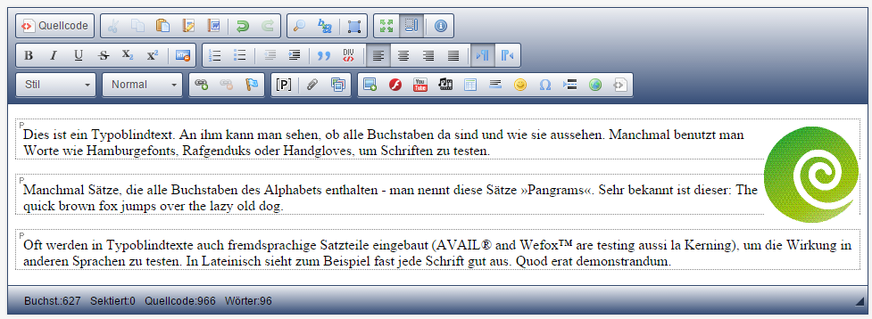

# CKEditor

Der CKEditor, auch WYSIWYG („What You See Is What You Get“) genannt, ermöglicht die einfache Pflege der Inhalte auf den Content-Seiten der Website. Nicht nur Text, sondern auch Medien wie Bilder, Videos oder Dokumenten-Downloads lassen sich mit ihm platzieren.
Der Editor findet sich vor allem in Fließtextmodulen.

Die einzelnen Funktionen ähneln dabei denen von bekannten Textverarbeitungsprogrammen.
Weitere Informationen finden sich unter http://ckeditor.com/ bzw. eine Erklärung zu den Funktionen unter http://docs.cksource.com/CKEditor_3.x/Users_Guide. 