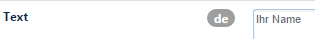
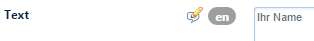
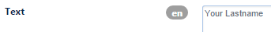

# CMS Webübersetzungen

CMS / Portal-Einstellungen → CMS Webübersetzungen

Dies ist die zentrale Stelle im CHAMELEON-CMS, um alle im Frontend stehenden übersetzbaren Texte in andere Sprachen zu übersetzen.

| Bezeichnung | Beschreibung |
| -- | -- |
| Key | eindeutiger Schlüssel des zu übersetzenden Textes |
| Text | der zu übersetzende Text |
| Hinweis | Hinweistext |

Suchen Sie den Begriff, den Sie übersetzen wollen und öffnen diesen Datensatz.
Das Sprachflag beim Textfeld zeigt Ihnen an, in welcher Editiersprache Sie sich gerade im Backend befinden.

Stellen Sie nun auf die gewünschte Editiersprache um. Das zu übersetzende Feld ist durch das entsprechende Flag gekennzeichnet. Noch nicht übersetzte Felder erkennen Sie anhand des Bearbeitungsstiftes.

Übersetzen Sie den Text und speichern Sie den Datensatz.

