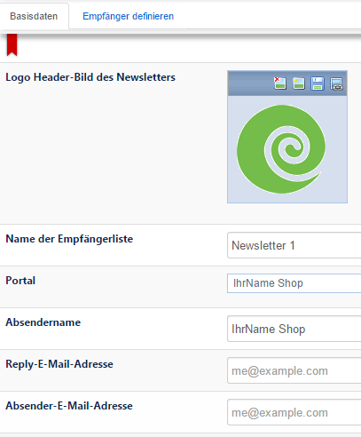
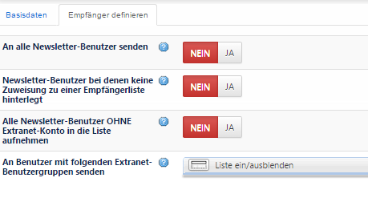
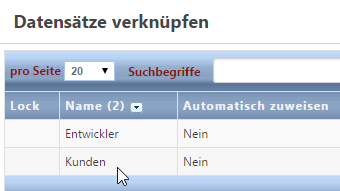
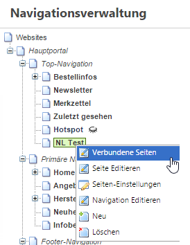
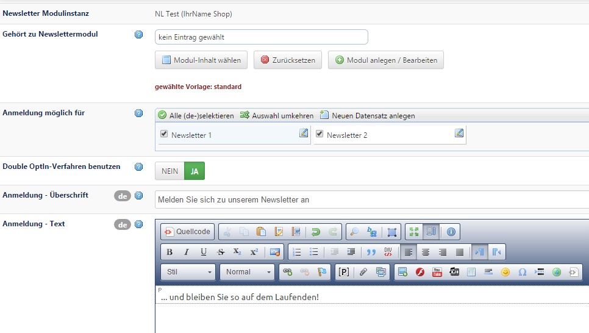
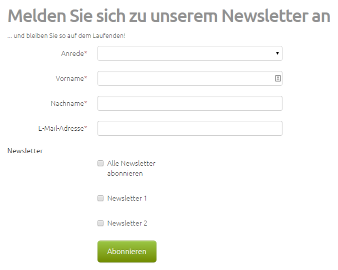

# Grundkonfiguration

#### Empfängerlisten / Konfiguration

*Newsletter → Newsletter-Empfängerlisten / Konfiguration*

Richten Sie zuerst eine Empfängerliste ein. Sie dient dazu, dass ihre zukünftigen Abonnenten in einen Verteiler geschrieben werden. Sie können auch mehrere Empfängerlisten einrichten und somit unterschiedliche Newsletter beispielsweise an unterschiedliche Interessengruppen versenden. Wichtig bei der Konfiguration der Empfängerliste ist, dass Sie ihr entsprechendes Portal angeben. Außerdem sollten Sie immer eine Reply- und Absender-E-Mail Adresse angeben. 

**<u>Basisdaten:</u>**

Zusätzlich können in der Empfängerliste individuelle Versandeinstellungen vorgenommen werden:

**<u>Empfänger definieren:</u>**

| Name | Beschreibung |
| -- | -- |
| **An alle Newsletter-Benutzer senden** | Hier können Sie auf einen Schlag alle Newsletter-Abonnenten dieser Empfängerliste zuweisen. |
| **Newsletter-Benutzer, bei denen keine Zuweisung zu einer Empfängerliste hinterlegt ist** | Bei den Newsletter-Benutzern hat man die Möglichkeit, eine oder mehrere Empfängerlisten auszuwählen. Diese Benutzer werden den entsprechenden Empfängerlisten immer zugewiesen. Über diesen Schalter lassen sich die Newsletter-Benutzer zuweisen, bei denen keine Empfängerliste hinterlegt wurde. |
| **Alle Newsletter-Benutzer OHNE Extranet-Konto in die Liste aufnehmen** | Fügt alle Newsletter-Benutzer der Empfängerliste bei, die kein Extranet-Konto, also kein Kundenkonto, haben. |
| **An Benutzer mit folgenden Extranet-Benutzergruppen senden** | Alle Newsletter-Benutzer, die auch ein Extranet-Konto (also Kundenkonto) besitzen und bei denen eine Kundengruppe hinterlegt ist, werden der entsprechenden Empfängerliste hinzugefügt.|

#### Anmeldung

Um Ihren Kunden einen Newsletter anbieten zu können, muss es für diese möglich sein, sich für ein Newsletter-Abo anzumelden. Richten Sie daher einen Navigationspunkt “Newsletter” ein (z.B. in der Top-Navigation). Verknüpfen Sie mit diesem Navigationspunkt die Systemseite „Newsletter Anmelden“ (Rechtsklick auf den eben angelegten Navigationspunkt „Newsletter“ → Verbundene Seiten → Neu → Seite „Newsletter Anmelden“ aus der Liste auswählen und JA bei Seitenverbindung aktiv).

Über ***Seite editieren*** können Sie den Anmeldevorgang im Steckplatz „Newsletter Signup“ in seinen einzelnen Schritten beschriften.

Wichtig ist, dass Sie auf der Anmeldeseite beim Feld *Anmeldung möglich für* angeben, für welchen Newsletter die Anmeldung möglich ist (also die Empfängerliste auswählen, auf die die Abonnenten nach ihrer Anmeldung geschrieben werden sollen).

Außerdem sollte das Feld ***DoubleOptIn-Verfahren benutzen*** unbedingt auf *JA* eingestellt sein, da dies von der derzeitigen Rechtslage vorgeschrieben ist. Dieses Verfahren sorgt dafür, dass der Benutzer nach Ausfüllen des Anmeldeformulars zunächst eine E-Mail zugesandt bekommt, in der ihm ein Link zur endgültigen Anmeldung zur Verfügung steht. Es verhindert beispielsweise, dass jemand fremde E-Mail-Adressen auf den Newsletter-Verteiler setzt. Die Option Double-Opt-In auszuschalten ist somit nur für den internen Gebrauch bestimmt.

**<u>Ansicht der Newsletter-Anmeldeseite im Frontend:</u>**

#### Abmeldung

Die Abmeldeseite „Newsletter Abmelden“ ist ebenfalls bereits als Systemseite eingerichtet. Die Texte können Sie selbst nach Ihren Wünschen eingeben.

Wenn diese Grundeinstellungen vorgenommen sind, kann nun ein Newsletter erstellt und versendet werden.