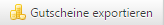

# Gutscheinserien

Rabatte & Gutscheine → Gutscheinserien

Im System können Gutscheine hinterlegt werden, die einen absoluten oder prozentualen Wert als Nachlass gewähren. Prozentuale Nachlässe beziehen sich immer auf die Bruttosumme der Produkte, bevor Rabatte oder ähnliches angerechnet werden. Zusätzlich kann bei einem Gutschein ein Gratisartikel hinterlegt werden (wenn das entsprechende Modul installiert ist). Wird ein solcher Gutschein mit Gratisartikel eingelöst, legt das System den Artikel mit einem Wert von 0,- € in den Warenkorb. Zusätzlich erscheint der Hinweis, über welchen Gutschein der Artikel in den Warenkorb gelegt wurde. Neben dem Hinweis erscheint weiterhin ein Link, über den der Gutschein wieder aus dem Warenkorb genommen werden kann.

Geldwert-Gutscheine erscheinen unterhalb der Produktbruttosumme mit Namen und Wert. Zusätzlich wird neben jedem Gutschein ein Link angezeigt, über den der Gutschein wieder aus dem Warenkorb entfernt werden kann.

Gutscheine werden generell in Gutscheinserien angelegt. Alle Einstellungen beziehen sich auf die Gutscheinserie, und damit auf alle Gutscheine in dieser Serie. Für eine Gutscheinserie können automatisch Gutscheine generiert werden. Hier kann entweder ein fester Gutscheincode angegeben werden oder ein vom System automatisch generierter Code verwendet werden.

Innerhalb einer Gutscheinserie darf ein Gutscheincode mehr als einmal vorkommen, ein Gutscheincode darf aber nie in mehr als einer Gutscheinserie verwendet werden2. Bei jedem Gutschein wird ein Erstellungsdatum hinterlegt. 
Der Gutscheinwert selbst wird immer aus der Gutscheinserie genommen (verändert man diesen Wert, verändert sich auch automatisch der Gutscheinwert). Bei jeder Verwendung eines Gutscheins wird das Datum, der Benutzer sowie der Verbrauchswert beim Gutschein in der Gutscheinverwendungsliste hinterlegt. Sobald der Gutschein komplett verbraucht ist, wird das Verbrauchsdatum hinterlegt und der Gutschein als verbraucht markiert. 
Die Gutscheine einer Gutscheinserie können als CSV-Datei exportiert werden. Für jeden Gutschein werden folgende Daten exportiert:

| Bezeichnung | Beschreibung |
| -- | -- |
| Code | Identifikationscode des Gutscheins |
| Datum | Erstellungsdatum |
| Verbraucht (Ja / Nein) | Markierungsfeld zur Identifikation, ob Gutschein als verbraucht markiert wurde |
| Verbrauchsdatum | wird hinterlegt, sobald ein Gutschein komplett verbraucht wurde  |
| Restwert | möglicher unverbrauchter Restwert des Gutscheines |

Gutscheine können für alle Benutzer verwendbar sein oder auf bestimmte Benutzergruppen oder Benutzer eingeschränkt werden.

Gutscheine können einen Gutscheinsponsor haben, der für den Gutschein gezahlt hat, siehe *Gutscheinsponsoren*.

Gutscheine, die nicht „gesponsert“ und damit nicht tatsächlich bezahlt sind, dürfen nicht auf Artikel zugreifen, die von Gutscheinen ausgeschlossen wurden. Die für den Gutschein relevante Mindestbestellsumme sowie der Warenkorbwert (der nicht unter Null fallen darf) beziehen sich immer auf die Summe der Artikel, die nicht von Gutscheinen ausgeschlossen wurden. 

Folgende zusätzliche Einstellungen und Einschränkungen sind möglich:

* Über ein Start- und Enddatum kann ein Gutschein auf eine Zeitspanne eingeschränkt werden.
* Es kann ein Mindestbestellwert definiert werden, der überschritten werden muss, bevor der Gutschein akzeptiert wird.
* Ob der Gutschein mit einem anderen Gutschein der gleichen Gutscheinserie verwendet werden kann.
* Ob der Gutschein mit anderen Gutscheinen (egal von welcher Gutscheinserie) verwendet werden kann.
* Ob ein Kunde Gutscheine dieser Gutscheinserie generell nur einmal verwenden darf (also auch nicht bei zwei getrennten Bestellungen).
* Ob der Gutschein nur bei der ersten Bestellung des Benutzers verwendet werden kann.
* Ob der Gutschein die Versandkosten aufheben soll.
* Es ist möglich, den Gutschein als einen „gesponserten“ Gutschein zu markieren. Zusätzlich können der Name des Sponsors, ein Bild und ein Logo hinterlegt werden. „Gesponserte“ Gutscheine ignorieren die Einstellung „keine Gutscheine zulassen“ der Warenkorbartikel im Warenkorb.

Folgende Felder stehen bei der Erstellung einer neuen Gutscheinserie zur Verfügung:

| Bezeichnung | Beschreibung |
| -- | -- |
| Name | Bezeichnung der Gutscheinserie |
| Gutscheinsponsor | Auswahl des Sponsoren, der zuvor unter „Gutscheinsponsoren“ angelegt wurde |
| Wert | Der Wert jedes einzelnen Gutscheins dieser Serie. Der Wert kann absolut oder prozentual (zum Gesamtwarenkorb) angegeben werden (wird über das Feld „Wertart“ definiert). |
| Wertart | definiert, ob es sich bei dem Feldwert um einen Absolutwert oder um eine Prozentangabe handelt. Prozentangaben beziehen sich immer auf den Gesamtwert des Warenkorbs.
 |
| Umsatzsteuergruppe | Wird für die Serie keine Umsatzsteuergruppe gewählt, dann gilt immer die in den Shopeinstellungen hinterlegte Standardgruppe. |
| Gratisartikel* | Ein hier hinterlegter Artikel wird bei Verwendung des Gutscheins gratis in den Warenkorb gelegt. |
| Gratisversand | Wird ein Gutschein mit dieser Markierung verwendet, betragen die Versandkosten 0,- €. |
| Aktiv | Aktiviert / deaktiviert die Serie und alle dazu gehörenden Gutscheine. |
| Aktiv ab | Legt ein Datum fest, ab welchem die Gutscheine der Serie verwendet werden können.
 |
| Aktiv bis | Legt ein Datum fest, bis zu welchem die Gutscheine der Serie verwendet werden können. |
| Mindestbestellwert | Gutscheine dieser Serie dürfen erst ab diesem Bestellwert verwendet werden. |
| Nur mit anderen Serien zulassen | Gutscheine dieser Serie dürfen nur mit Gutscheinen anderer Serien verwendet werden. |
| Nicht in Kombination mit anderen Gutscheinen zulassen | Gutscheine dieser Serie dürfen nicht in Kombination mit anderen Gutscheinen verwendet werden (egal von welcher Serie). |
| Nur einen Gutschein pro Kunde zulassen | Ein Kunde darf nur einen Gutschein dieser Serie verwenden (kann nur bei registrierten Kunden geprüft werden). |
| Nur bei der ersten Bestellung eines Kunden zulassen | Kann nur nach Registrierung des Kunden geprüft werden. |
| Auf folgende Kunden einschränken | Filter |
| Auf folgende Kundengruppen einschränken | Filter |
| Auf Produkte dieser Hersteller einschränken | Filter |
| Auf Produkte aus diesen Artikelgruppen einschränken| Filter |
| Auf Produkte aus diesen Kategorien einschränken | Filter |
| Auf diese Produkte einschränken | Filter |
| Gutscheine der Serie | Eine Übersicht aller zur Serie gehörenden Gutscheine |

*nur verfügbar, wenn das Modul Gratisartikel freigeschaltet ist

