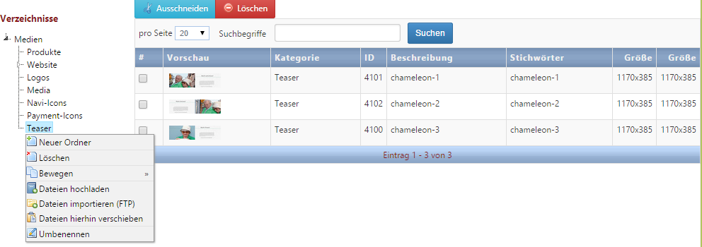

# Media

Über den Punkt *Medien* gelangt man zu der zentralen Bilder- und Medienverwaltung im Chameleon-System. Hier können neue Medien wie Bilder und Videos hochgeladen sowie bestehende entfernt oder aktualisiert werden. Alle Bilder / Videos, die auf der Webseite angezeigt werden sollen, müssen zuerst in der Medienverwaltung hinterlegt werden. 

Via the button Media you get to the image and media administration. In here you can upload images and videos and also delete and update existing ones. Every image and video which should be displayed on your website has to be deposit into the media handling first.

~~Die Verwaltung öffnet sich in einem neuen Fenster (d.h. die aktuelle Seite, die man bearbeiten möchte, bleibt im Hintergrund geöffnet).~~

The administration opens in a new window (so the current page stays open and available in the background).

~~Die Verzeichnisstruktur links und die Suchfunktion unten ermöglichen ein schnelles Auffinden der gesuchten Datei. Über die rechte Maustaste erreicht man das Kontextmenü. Hier hat man die Möglichkeit, die Baumstruktur links zu bearbeiten (Ordner anlegen, löschen, verschieben, umbenennen) und Dateien hochzuladen, zu importieren oder zu verschieben. Es können mehrere Dateien gleichzeitig hochgeladen werden.~~ 

It is possible to find the relevant file very quick via using the folder structure on the left or the searching box below. You get to the context menu via right-clicking. In here you can edit the folder structure on the left (create, delete, move and rename folder). You can also upload folders, import and move them. You are able to upload several folders at the same time.

| Bezeichnung | Beschreibung |
| -- | -- |
| Neuer Ordner | Erstellt einen neuen Ordner. |
| Löschen | Verzeichnis sowie alle Unterverzeichnisse und Medien werden entfernt. Alle Zuweisungen in Seiten und Datensätzen werden entfernt. |
| Bewegen | Versetzen kompletter Baumknoten innerhalb der Baumstruktur. |
| Dateien hochladen | Manuelles Hochladen der Dateien vom Client-Rechner. |
| Dateien importieren (FTP) | Importieren aller Dateien, die im Verzeichnis *private/cmsdata/mediaImport* liegen und zuvor per FTP *(FTP-Zugang erforderlich)* hochgeladen wurden. |
| Dateien hierhin verschieben | Alle Dateien, die markiert und ausgeschnitten wurden, können über diese Funktion in das markierte Verzeichnis verschoben werden. |
| Umbenennen | Benennt ein Verzeichnis um. |

| Designation | Description |
| -- | -- |
| New Folder | Creates a new folder. |
| Delete | All directories, sub-directories  and medias will be deleted. Allocations to pages and data sets will be deleted completely. |
| Move | Moves complete tree knots within the tree structure. |
| Upload Data | Manual upload of the files from the client computer. |
| Import data (FTP) | Imports all data, which are located in the directory *private/cmsdata/mediaImport* and were uploaded via FTP *(FTP-Login necessary)* previously. |
| Move folders in here | All selected and cut files can be moved into the selected directory. |
| Rename | Renames a directory. |

Möchten Sie ein Bild oder Video durch ein anderes ersetzen, rufen Sie den entsprechenden Datensatz auf und laden über ***Mediendatei ersetzen*** die neue Datei hoch. Das Bild (Video, ...) wird nun an allen hinterlegten Stellen auf der Website automatisch ersetzt.

You can replace an image or video via ***Replace Media File*** in the relevant data set. The image (video etc.) is replaced automatically where it was deposited as well.

Please note: Do not upload media files using cmyk format. Furthermore you should take care that the media files dissolution is not that big (for example directly from the camera) In some cases you will get a problem depending on the server configuration.Beim Bildmaterial muss grundsätzlich darauf geachtet werden, dass keine Bilder im CMYK-Format hochgeladen werden. Des Weiteren sollte darauf geachtet werden, dass nach Möglichkeit keine Bilder in zu hoher Auflösung (z.B. direkt von der Kamera) hochgeladen werden - je nach Server-Konfiguration kann dies zu Problemen führen. Die Dateigröße darf die unter *CMS Einstellungen → Uploader Konfiguration* eingestellten Upload-Werte nicht überschreiten.