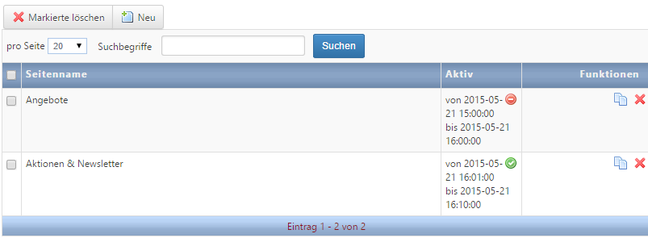

# Link several pages to one navigation knot

Wenn Sie weitere Seiten mit einem Navigationspunkt verbinden wollen, gehen Sie im Rechtsklick-Menü des Navigationspunktes auf ***Verbundene Seiten***. Hier können Sie über ***Neu*** eine weitere Seite aus der Liste auswählen und mit dem Punkt verknüpfen. Die Seitenverbindung muss aktiv sein. Außerdem können Sie hier den Veröffentlichungszeitraum bestimmen, so dass z.B. automatisch zwischen einer Sommer- und Winterseite umgeschaltet wird.

If you want to link several pages with one navigation point, you can do that via right-clicking on the navigation point to **Linked Pages**. You can select one more page via **New**** from the list to link it to the navigation knot. The page connection has to be active. Furthermore you can define a release date. For example you can switch from a winter- to a summer page automatically.

