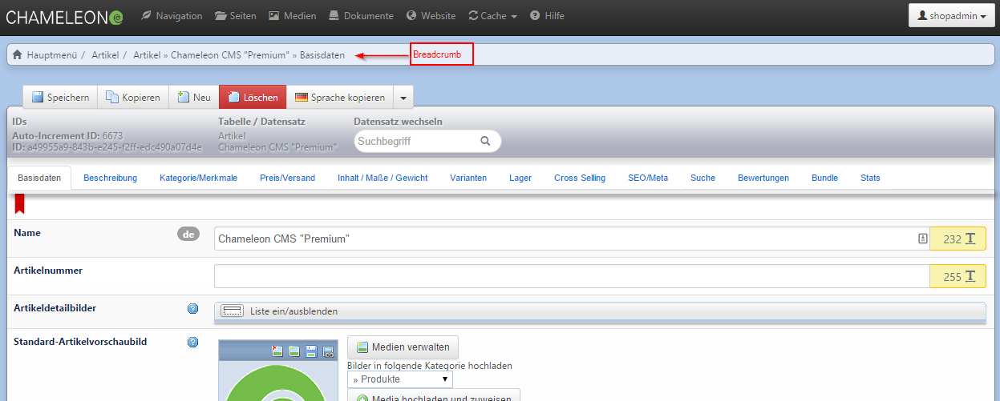
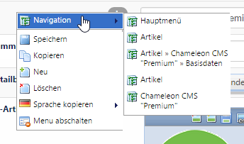

# Menu navigation

~~Über das Top-Menü (schwarze Leiste oben) haben Sie einen Schnellzugriff auf die Navigation, die Seiten, Medien und Dokumente, verschiedene Editiersprachen, das Frontend, den Cache und die Hilfe. Darunter findet sich das Hauptmenü, welches in verschiedene Blöcke unterteilt ist.~~

You can have a quick asset to the navigation, the pages, medias and documents, several editing languages, the frontend, the cache and the support button via clicking the top menu (black bar above). The main menu is classified in several blocks below.

~~Über die Breadcrumb verfolgt das System die vom Benutzer durchgeführten Schritte. Mit Klick auf einen der Punkte können Sie jederzeit zur vorher angesteuerten Seite zurückkehren.~~

The system is able to track all steps via breadcrumb, which are made by the user. By clicking one if the items you can get back to the page which you have previously visited. This is possible at any time.

~~Innerhalb eines Datensatzes stehen die Punkte der Breadcrumb auch über das Rechtsklick-Menü zur Verfügung.~~

Items of the breadcrumb are available via right-clicking within a dataset. 

