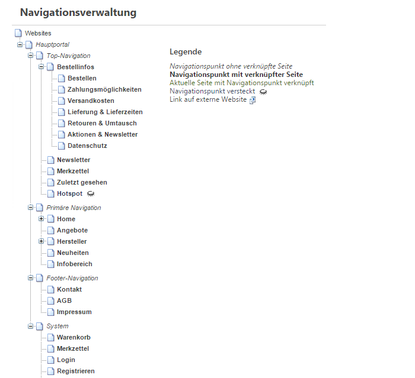
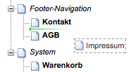

# Navigation Management

~~Die Navigationsverwaltung öffnet sich über den Button *Navigation* im Topmenü (in einem PopUp-Fenster). Über die Navigationsverwaltung lässt sich die Seitenstruktur der Webseite definieren.~~

You can open the navigation menu by clicking the button *Navigation* in the top menu (in a PopUp window). You can define the page structure via the navigation menu.

Dabei muss zwischen dem Seitenbaum und den einzelnen Seiten unterschieden werden, denn Navigationspunkte und Seiten sind zwei voneinander getrennte Objekte. So kann eine Seite mit mehreren Navigationspunkten verbunden sein, z.B. eine Kontaktseite, die in der Hauptnavigation sowie in der Footer-Navigation verlinkt sein soll.

Außerdem ist es möglich, mehrere Seiten mit einem Navigationspunkt zu verbinden. Welche Seite dem Website-Besucher angezeigt wird, ergibt sich aus den Verbindungseinstellungen (aktiv j/n sowie dem Aktivierungszeitraum). Damit ist es z.B. möglich, Jahreszeiten-abhängig komplett unterschiedlich gestaltete Home-Seiten einzurichten. 

Aus dem Seitenbaum ergeben sich die URLs für die einzelnen Seiten. Dabei werden die einzelnen Einträge aus dem Baum bis zu der gewünschten Seite durch ein "/" getrennt aneinander gereiht. Da URLs nicht alle Zeichen unterstützen, werden Sonderzeichen entfernt oder ersetzt (ä=ae, ö=oe, usw.). Leerzeichen werden durch ein "-" ersetzt.

Da über den Baum die Navigationen von mehr als einer Webseite verwaltet werden können und auch Webseiten mehr als eine Navigation enthalten können, beginnt der Pfad der URL an dem Punkt, an welchem in den Portaleinstellungen eine Navigation und ein Bereich definiert wurde.

So kann z.B. die Primäre Navigation, die Top-Navigation und die Footer-Navigation unterschieden werden. Wichtig ist dabei, dass es keine identischen Navigationspunkte gibt, da das System keine gleichlautenden Punkte unterscheiden kann (Ausnahme ist, wenn es sich bei den Punkten tatsächlich um die gleiche Seite handelt (also z.B. "Home" unter der Primären sowie der Top-Navigation).

Einträge im Baum können über Drag-and-Drop untereinander positioniert werden. 

Über Rechtsklick können Navigationspunkte angelegt, editiert oder gelöscht werden. Ist bei einem Punkt bereits eine Seite hinterlegt, kann diese per Rechtsklick editiert werden ***(Seite editieren)*** oder es können die Einstellungen der Seite geöffnet werden ***(Seiten- Einstellungen)***.