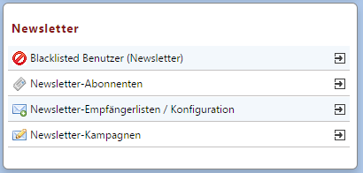

# Newsletter-Elemente

### Blacklisted Benutzer

Die Liste der Blacklisted Benutzer ist eine Schutzliste mit den E-Mail-Adressen der Personen, die keine unaufgeforderte Werbung erhalten wollen. Sie dienen dem Kundenschutz vor unerwünschter Werbung. Seriöse Unternehmen verpflichten sich, dem Wunsch ihrer registrierten Kunden nach Werbefreiheit nachzukommen und sie nicht weiter zu kommerziellen Zwecken per E-Mail zu kontaktieren.
Die in der Liste hinterlegten E-Mail-Adressen werden beim Newsletter-Versand ausgeschlossen.

### Newsletter-Abonennten

Hier werden die Abonnenten, die sich über das Anmeldeformular angemeldet haben, aufgelistet (auch diejenigen, deren Anmeldung noch nicht über den zugesandten Link bestätigt wurde; diese sind durch den Eintrag *Anmeldung wurde bestätigt*: *NEIN* zu erkennen). Jede Anmeldung ist einem bestimmten Kunden zugewiesen und kann eindeutig identifiziert werden. Der exakte Zeitpunkt der Anmeldung und die der Bestätigung kann hier ebenfalls abgelesen werden.

| **Name** | Beschreibung |
| -- | -- |
| **Gehört zum Kunden** | gibt an, zu welchem Kunden diese Newsletter-Anmeldung gehört |
| **Abonennten der Empfängerlisten** | eine Liste der Empfängerlisten, in welche der Kunde aufgenommen wurde |
| **Anmeldebestätigungen** | Liste der Newsletter, bei welchen der Kunde angemeldet ist |
| **E-Mail-Adresse** | E-Mail-Adresse, an die der Newsletter versendet werden soll |
| **Anmeldedatum** | Zeitpunkt, zu dem die Newsletter-Anmeldung erfolgte |
| **Anmelde Code** | interner Code zur Realisierung des Double-Opt-In-Verfahrens |
| **Anmeldung wurde bestätigt** | wird auf JA gesetzt, wenn der Kunde die Anmeldung bestätigt hat |
| **Datum der Anmeldebestätigung** | Zeitpunkt, wann die Anmeldung bestätigt wurde |
| **Abmelde-Code** | interner Code zur Realisierung des Double-Opt-Out-Verfahrens |

### Newsletter-Empfängerlisten / Konfiguration

Eine Empfängerliste definiert sozusagen die Grundeinstellungen eines Versandes. Hier wird u.a. festgelegt, welche E-Mail-Adresse und welcher Name als Absender des Newsletters angegeben werden und an welche E-Mail-Adresse Antworten des Abonnenten gelangen.
Es sind unterschiedliche Empfängerlisten möglich. Durch die Anmeldeseite wird dem Newsletter-Benutzer eine bestimmte Empfängerliste zugeteilt oder der Benutzer darf selbst auswählen, welche(n) Newsletter er erhalten will.
