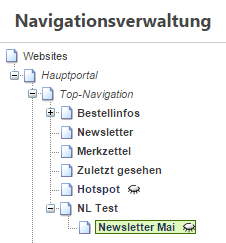

# Newsletter erstellen und versenden

### Newsletter-Seite erstellen

Der Newsletter wird als Seite im Backend angelegt. Sie können die Newsletter z.B. unter dem Menüpunkt „Newsletter“ als versteckte Seiten anlegen (versteckt, damit sie nicht verlinkt auf Ihrer Website erscheinen). Sie können aber auch einen eigenen Navigationspunkt *Newsletter* unter dem Hauptportal anlegen und darunter die einzelnen Newsletter-Seiten hängen (in diesem Fall muss auch der oberste Navigationspunkt versteckt sein).

Für ein einheitliches CI empfiehlt es sich, vorab eine Seitenvorlage für den Newsletter zu erstellen, die Sie dann einfach bei jeder Newsletter-Seite verwenden können (Navigation editieren → Seiten/Layouts).
Auf der angelegten Seite können Sie nun die dynamischen Steckplätze editieren. Durch Eingabe des Pfades in die Adressleiste Ihres Browsers können Sie den erstellten Newsletter abrufen, oder nutzen Sie die Vorschau-Funktion im Backend.

### Kampagen anlegen

Newsletter → Newsletter-Kampagnen

Nachdem Sie Ihren Newsletter fertig bearbeitet haben, erstellen Sie eine neue Kampagne. Diese dient dazu, den jeweiligen Newsletter einer Empfängerliste zuzuweisen und das Versenden vorzubereiten.

**<u>Basidaten:</u>**

Hier ist es wichtig, dass Sie das entsprechende Portal auswählen, die im vorherigen Schritt erstellte Newsletter-Templateseite durch ***Ast zuweisen*** und die Empfängerliste durch ***Auswählen*** hinzufügen.