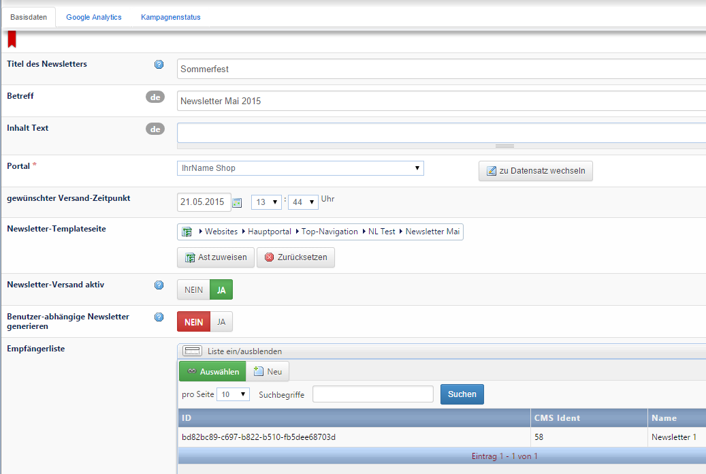
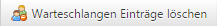

# Newsletter erstellen und versenden

#### Newsletter-Seite erstellen

Der Newsletter wird als Seite im Backend angelegt. Sie können die Newsletter z.B. unter dem Menüpunkt „Newsletter“ als versteckte Seiten anlegen (versteckt, damit sie nicht verlinkt auf Ihrer Website erscheinen). Sie können aber auch einen eigenen Navigationspunkt *Newsletter* unter dem Hauptportal anlegen und darunter die einzelnen Newsletter-Seiten hängen (in diesem Fall muss auch der oberste Navigationspunkt versteckt sein).

Für ein einheitliches CI empfiehlt es sich, vorab eine Seitenvorlage für den Newsletter zu erstellen, die Sie dann einfach bei jeder Newsletter-Seite verwenden können (Navigation editieren → Seiten/Layouts).

Auf der angelegten Seite können Sie nun die dynamischen Steckplätze editieren. Durch Eingabe des Pfades in die Adressleiste Ihres Browsers können Sie den erstellten Newsletter abrufen, oder nutzen Sie die Vorschau-Funktion im Backend.

#### Kampagen anlegen

*Newsletter → Newsletter-Kampagnen*

Nachdem Sie Ihren Newsletter fertig bearbeitet haben, erstellen Sie eine neue Kampagne. Diese dient dazu, den jeweiligen Newsletter einer Empfängerliste zuzuweisen und das Versenden vorzubereiten.

**<u>Basidaten:</u>**

Hier ist es wichtig, dass Sie das entsprechende Portal auswählen, die im vorherigen Schritt erstellte Newsletter-Templateseite durch ***Ast zuweisen*** und die Empfängerliste durch ***Auswählen*** hinzufügen.

Durch das *Aktiv*-Setzen des *Newsletter-Versands* werden die zugehörigen Abonnenten nach erstmaligem Abspeichern aus der *Empfängerliste* in die *Warteschlangen-Einträge* (Tab *Kampagnenstatus*) geladen. Hier können Sie die der Empfängerliste zugeordneten Email-Adressen sehen.

Durch ein zweites Abspeichern wird der auf der Templateseite hinzugefügte Newsletter den in der Warteschlange stehenden Abonnenten zugewiesen. Das Versenden erfolgt nun automatisch durch den dafür zuständigen Cronjob (der Cronjob prüft automatisch, ob Newsletter zum Versenden bereit sind).

Es empfiehlt sich, vor dem Senden des Newsletters zuerst einen Test-Newsletter zu versenden, damit Sie noch einmal überprüfen können, ob alles stimmt, wie der Newsletter im Email-Programm aussieht usw. Dafür legen Sie eine Test-Empfängerliste mit Ihrer Emailadresse und ggf. weiteren Adressen an und verknüpfen zunächst nur diese Empfängerliste mit der Kampagne. 

Wenn der Test erfolgreich war, verknüpfen Sie nun die richtige Empfängerliste mit der Kampagne, und löschen außerdem die Warteschlangen-Einträge 
 des Testversands (ansonsten wird der Newsletter trotz Aktiv-Schaltung nicht versendet, da das System bei Einträgen davon ausgeht, dass der Job schon erledigt wurde). Speziell dafür gibt es den Button am oberen Rand des Datensatzes.

<u>Hinweis:</u> Um Änderungen an den Warteschlangen-Einträgen zu sehen, müssen Sie die Kampagne neu aufrufen.

Um Text-Newsletter ebenfalls zu ermöglichen, besteht die Möglichkeit, zu jedem Newsletter eine Nur-Textversion der Inhalte über  das Textfeld *Inhaltstext* (sh. *Basidaten*) zu hinterlegen. Da die meisten Mailprogramme nur stark eingeschränktes HTML zulassen, kann eine spezielle Seitenvorlage für den Newsletter erstellt werden. Hierbei kann auf alle Funktionen des CMS zurückgegriffen werden. Jeder Newsletter ist auch über die Webseite selbst erreichbar und enthält automatisch einen Link auf die entsprechende Seite. Dadurch kann man Kunden, bei denen der Newsletter nicht richtig dargestellt wird oder welche nur Textmails empfangen können, durch Zusenden dieses Links im Text-Newsletter den Newsletter so anzeigen, wie er ursprünglich vom Designer entworfen wurde.

#### Cronjob Newsletter versenden

Sobald der Cronjob *Newsletter versenden* ausgeführt wird, werden die Newsletterkampagnen ausgeführt und somit der zugewiesene Newsletter an die Abonnenten aus der Warteschlange vesandt. Dies kann eventuell ein paar Minuten dauern, je nachdem in welchem Abstand dieser Cronjob ausgeführt wird (in der Regel alle 5 min).

Der Cronjob ist bereits entsprechend eingestellt, wenn das Newsletter-Modul installiert ist.

