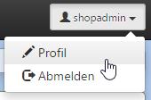

# Personal user profile

Im Profil des CMS-Benutzers kann dieser seine persönlichen Angaben wie Name, Passwort, E-Mail, Bild, Editiersprache des Backend usw. ändern. Als Benutzer mit administrativen Rechten hat man im Profil die Möglichkeit, dem Benutzer bestimmte Rollen zuzuordnen.
Das persönliche Profil ist über das Top-Menü (schwarze Leiste) erreichbar.

You can change your personal details such as your name, password, email-address, profile picture, editing language of the backend etc. in the profile of the CMS user. Users with administrative rights are able to assign different roles. Your personal profile is accessible (black bar).

