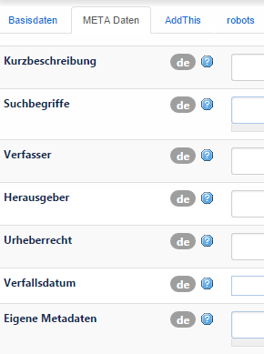
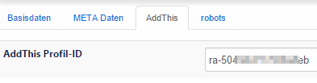
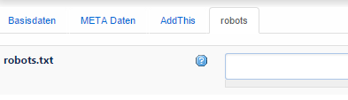
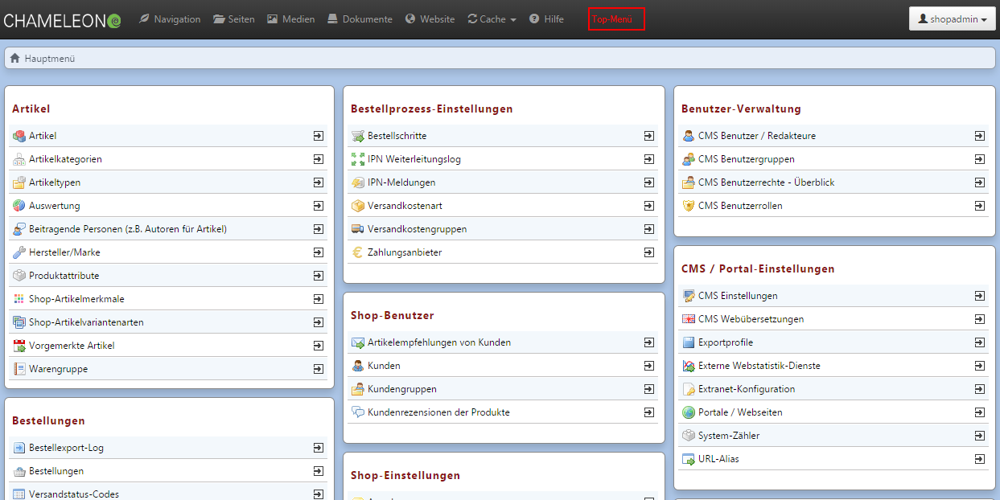

# Portale / Webseiten

*CMS / Portal-Einstellungen → Portale / Webseiten*

Mit Chameleon können mehrere Webseiten oder Shops parallel betrieben werden. Jede dieser Webseiten wird als Portal geführt. An dieser Stelle legen Sie die Grundeinstellungen Ihrer Webseite fest.

Je Portal können beliebige Domain-Namen hinterlegt werden, unter welchen die Webseite erreichbar sein soll. Neben einer Domain-Unterscheidung, können auch mehrere Portale auf der gleichen Domain laufen, müssen dann aber über einen URL-Präfix unterscheidbar sein.

Jedes Portal wird in Chameleon in Bereiche unterteilt. Dabei sollte mindestens ein Bereich je Navigationsstartpunkt definiert werden. Über die Bereiche lassen sich Einstellungen hinterlegen, die für einen Sub-Baum innerhalb des Portals (also für eine ganze Reihe von Seiten) gelten soll. Dazu gehört unter anderem die Sprache des Bereichs.

Die zu einem Portal gehörenden Seiten können in mehrere Navigationen (Top- Navigation, Primäre Navigation, Footer-Navigation usw.) unterteilt werden. Dabei ist jeder Navigationseinstiegspunkt auch gleichzeitig der URL-Startpunkt der sich darunter befindenden Seiten (der Navigationspunkt selbst wird dabei nicht mehr mit in der URL geführt).

Ist nur ein Portal definiert, gelangt man direkt in die Einstellungen des Portals, sind jedoch mehrere definiert, wird eine Auswahl eingeblendet.

  

*Basisdaten*

| Bezeichnung | Beschreibung | Erforderlich |
| -- | -- | -- |
| Name | Verwendung im CMS-Backend | ja |
| Titel des Portals | wird im title Tag der Seite verwendet und in der oberen Browserleiste dargestellt | ja |
| Homeseite des Portals | Hier muss die Startseite des Portals verknüpft werden | ja |
| 404 Page-Not-Found Seite | Die 404-Page wird immer angezeigt wenn eine nicht existierende Seite des Portals aufgerufen wird. | ja |
| Domains | Alle für das Portal zuständigen Domains, über welche das Portal erreichbar sein soll. | ja |
| Systemmeldungen / Fehlercodes | Hier kann der Benutzer die im System verwendeten Meldungen selbst beliebig anpassen. | ja |

 

*Metadaten*

 

*AddThis*

Falls Sie dieses Package installiert haben, können Sie hier eine AddThis Profil-ID eingeben. Dies dient dazu, Social Media Logos und den jeweiligen Link hinzuzufügen.

 

*robots*

Hier kann der Inhalt der robots.txt festgelegt werden. Bitte beachten: Der Feldinhalt wird nur ausgespielt, wenn KEINE robots.txt im document root hinterlegt wurde!

##### Speichern / Seitenbaum editieren

Am oberen Rand des Datensatzes steht der Button ***Seitenbaum Editieren*** zur Verfügung.

Hier haben Sie die Möglichkeit, den Seitenbaum des ausgewählten Portals zu editieren. Sie können die einzelnen Baumknoten per Drag&Drop verschieben oder mit der rechten Maustaste (Mac = Apfel linksklick) auf die Editiermöglichkeiten im Kontextmenü
zugreifen.

Der Seitenbaum kann aber auch zentral in der oberen Menüleiste (schwarz) beim Punkt *Navigation* angesteuert werden.

