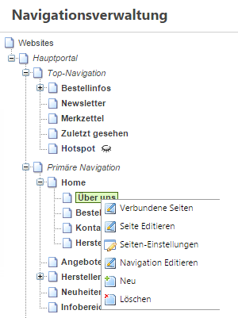
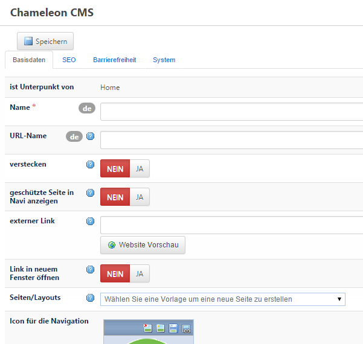
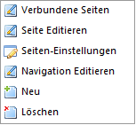

# Create page

Eine neue Seite können Sie entweder über die Navigationsverwaltung oder auch über die Seitenverwaltung ***(Neu)*** anlegen. Da sowieso vorher ein Navigationsknoten angelegt werden muss empfiehlt es sich, die Seite über den Navigationsbaum anzulegen.

You can create a new page via the navigation management and page management ***(New)***. Before that you have to create a navigation knot. So it makes sense to create the new page via the navigation tree.

Klicken Sie mit der rechten Maustaste auf den Navigationspunkt, unter dem die neue Seite angelegt werden soll. Ferner klicken Sie auf ***Neu***, um einen neuen Navigationspunkt anzulegen.

~~Es öffnet sich ein Dialog, bei dem u.a. folgende Angaben gemacht werden können:~~

A dialog window opens where you can furnish following particulars:

| Bezeichnung | Beschreibung |
| -- | -- |
| Name | Titel der Seite |
| URL-Name | wird an die URL des darüberstehenden Knoten angehängt. Mit der so entstehenden URL kann die Seite im Browser aufgerufen werden. Standardmäßig wird der URL-Name automatisch aus der Eingabe im Feld ‘Name’ kopiert. Der URL Name kann anschließend aber auch verändert werden. |
| Verstecken | Schaltet die Seite unsichtbar. Wichtig: Die Seite wird nur in der Navigation nicht aufgeführt, ist aber über Eingabe der URL, wenn bekannt, erreichbar. |
| externer Link | Sie können anstatt einer lokalen Seite auch eine externe Website in ihrer Navigation verlinken. Wichtig: Geben Sie hierbei den vollen Link mit http:// an. |
| Seiten / Layouts | Wenn Sie hier ein Seitenlayout wählen, wird daraufhin automatisch eine Seite angelegt und mit diesem Navigationspunkt verknüpft. Der Seitentitel wird dabei aus dem Namen des Navigationspunkts übernommen und kann später geändert werden. |
| SEO | Im SEO Tab haben Sie die Möglichkeit, den Navigationspunkt von der Indizierung durch Suchmaschinen auszuschließen und Ausnahmeregeln zu definieren. So können Sie z.B. dafür sorgen, dass die Kontaktseite, die auf allen Seiten in der Footer-Navigation verlinkt ist, auf allen Seiten außer der Home-Seite als noFollow markiert wird und so Linkpower von dieser Seite nehmen. |

| Designation | Description |
| -- | -- |
| Name | Name of the Page |
| URL-Name | assigned to the URL of the knot below. You can load the page in a browser with the resulting URL. Usually the URL name is copied automatically from the box 'Name'. It is also possible to change the name afterwards. |
| Hide | Changes the pages to "unvisible". Please note: The page is just not visible in the navigation. If the URL is known you can search for the page. |
| External Link | Instead of local pages you can also link external websites in your navigation. Please note: Type the complete link, including http://. |
| Pages / Layouts | If you choose a page layout here a new page is created and linked with the navigation point automatically. In this step the page title gets adopted from the name of the navigation point and can be changed afterwards. |
| SEO | In the SEO Tab it is possible to exclude the navigation point from the search engine indexing and define derogations. So können Sie z.B. dafür sorgen, dass die Kontaktseite, die auf allen Seiten in der Footer-Navigation verlinkt ist, auf allen Seiten außer der Home-Seite als noFollow markiert wird und so Linkpower von dieser Seite nehmen. |

Jetzt geben Sie der neuen Seite einen Namen und wählen ein Layout für die Seite (dies ist wichtig, da der Navigationspunkt ansonsten ohne Seite erstellt wird, zu erkennen an der Kursivschrift). Der Navigationspunkt und eine damit verbundene Seite werden daraufhin angelegt. Im Rechtsklick-Menü der Navigationsverwaltung haben Sie diese Menüpunkte:

| Bezeichnung | Beschreibung |
| -- | -- |
| Verbundene Seiten | Listet alle Seiten auf, die mit dem Navigationspunkt verbunden sind. Verbindungen können, wie oben beschrieben, auch von mehreren Seiten zeitabhängig auf einen Navigationspunkt erfolgen. |
| Seite editieren | Führt zur Layout-Ansicht der Seite und damit zur Möglichkeit, die Seiten-Inhalte zu editieren. |
| Seiten-Einstellungen | Führt zur Seiten-Konfiguration, wo Einstellungen wie: Extranet Gruppe, Seiten-Titel, Bild-Meta-Tags und weitere Navigationspunkte vorgenommen werden können. |
| Navigation editieren | Öffnet den vorher beschriebenen Dialog mit den Optionen des Navigationspunkts. |
| Neu | Legt einen Navigationspunkt (+ evtl. Seite) an |
| Löschen | Löscht den Navigationspunkt. Wichtig: Es wird nur der Navigationspunkt gelöscht, nicht aber die Seite. Diese müssen Sie manuell in „Meine Webseiten“ löschen oder können diese mit einem anderen Navigationspunkt verbinden. |

