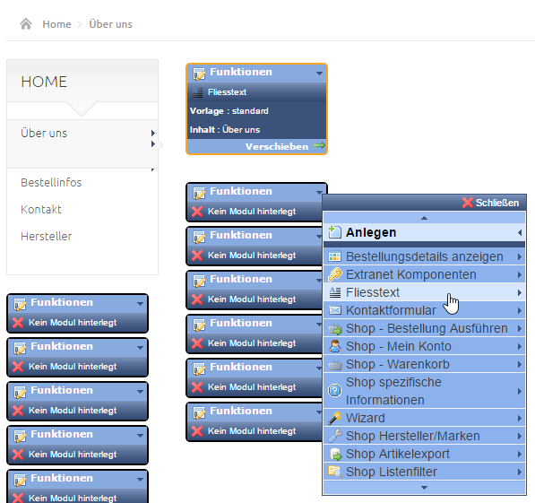
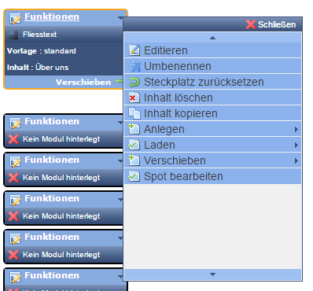
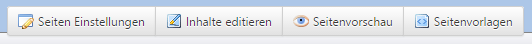

# Edit page / Create modules

~~Klicken Sie im Kontext-Menü des Navigationsbaums auf *Seite editieren* oder suchen Sie die Seite über *Seiten*. Der letztere Weg ist häufig der schnellere, wenn ihnen der Name der Seite bekannt ist, da Sie sich dann nicht durch den Navigationsbaum klicken müssen.~~

You can click the button *Edit page* in the context menu of the navigation tree or search for the page via *Pages*. The latter description is usually faster: When you know the name of the page you don't have to click yourself through the navigation tree.

~~In den Seitenvorlagen sind sogenannte Modul-Spots festgelegt. Dies sind Steckplätze, an die beliebige Module platziert werden können.~~

So called module spots are defined in the page template. These are slots, where you can place any module.

~~Über ***Funktionen*** können Sie ein neues Modul anlegen:~~

You can create a new module via **Functions**:

~~Bei einem bereits angelegten Modul gelangen Sie ebenfalls über ***Funktionen*** in das Kontextmenü zum Bearbeiten:~~

When you have an still existing module, you can also manage it in the context menu via **Functions**:

 

| Bezeichnung | Beschreibung |
| -- | -- |
| Editieren | Führt zu den Modul-Einstellungen bzw. zum Editieren der Inhalte des Moduls. Besteht das Modul aus mehreren Datentabellen, z.B. bei einer Liste, die Konfiguration der Liste (Sortiereinstellungen etc.) und Listeneinträge, so werden ihnen 2 Editiermöglichkeiten angeboten. |
| Vorlage ändern | Damit können Sie die HTML-Vorlage des Moduls wechseln. So können Sie z.B. für ein Listenmodul Vorlagen für eine Teaser-Liste mit Verlinkung auf eine Detailseite sowie eine Vorlage für eine Kurzliste ohne Detailseite erstellen. Je nach Modul und Projekt stehen Ihnen hier andere Vorlagen zur Verfügung, die auf Ihre Anforderungen angepasst wurden. |
| Umbenennen | Beim Anlegen einer neuen Modul-Instanz wird standardmäßig der Name der Seite, in der das Modul platziert wird, als Modul-Instanz-Name gesetzt. Sie sollten diesen auf jeden Fall sinnvoll umbenennen, damit Sie den Modul-Inhalt später wiederfinden können. |
| Steckplatz zurücksetzen | Leert den Modulsteckplatz. Das bisher hier angelegte Modul wird NICHT gelöscht, sondern ist nur nicht mehr mit diesem Steckplatz verbunden. Es kann also jederzeit über den Namen des Modul-Inhalts wiedergefunden und geladen werden. |
| Inhalt löschen | Löscht die Modul-Instanz und alle damit verbundenen Inhalte unwiderruflich (In der CHAMELEON Enterprise Edition mit aktivem Freigabe-Prozess gilt diese Aussage natürlich erst nach Freigabe der Löschung).Beim Löschen eines Listenmoduls werden dabei also die Konfigurationseinstellungen sowie alle Listeneinträge gelöscht. Inhalte, die nicht direkt über den Editieren-Dialog im Modul verwaltet werden, werden nicht gelöscht! Bei einem Artikel- Modul wird also z.B. nur die Selektionskonfiguration gelöscht, nicht aber die Artikel, die durch die Konfiguration in dem Modul angezeigt wurden. |
| Inhalt kopieren | Legt eine identische Kopie der Modul-Instanz inkl. aller verknüpften Modulinhalte an. Wenn Sie z.B. einen Textbaustein auf mehreren Seiten über die gleiche Instanz verwendet haben, aber auf einer Seite den Text ändern wollen, ohne dass sich dieser auf den restlichen Seiten auch ändert, müssen Sie vorher eine Kopie davon anlegen. |
| Anlegen | Gibt eine Liste aller zur Verfügung stehenden Module aus. Je nach Konfiguration der Steckplätze durch den Administrator kann sich die Liste je Steckplatz unterscheiden. So ist es z.B. möglich, dass in einer schmalen Spalte des Layouts die dort liegenden Modul-Steckplätze so eingestellt sind, dass nur Module wählbar sind, die dort vom Platz her auch hinpassen würden.|
| Laden | Gibt eine Liste aller im System vorhandenen Modul- Instanzen aus, aus der Sie ein Modul Laden können. |
| Laden (gemeinsame Instanz) | Lädt ein Modul als gemeinsame Instanz. Das bedeutet, dass diese Modul-Instanz (inklusive Inhalt) an mehreren Stellen vorhanden ist und Sie beim Editieren des Moduls auch alle anderen Stellen verändern. |
| Laden (als Kopie) | lädt ein Modul als Kopie (siehe auch: „Inhalt kopieren“). Somit kann Inhalt von einer anderen Stelle kopiert und verändert werden, an der ursprünglichen Stelle bleibt dieser aber unverändert. |
| Verschieben | Wie oben bereits als Drag&Drop-Option erklärt, haben Sie hier die Möglichkeit, das Modul an einen anderen Spot zu verschieben. Bei Mouse-Over über den Spotnamen wird Ihnen der entsprechende Spot in der Seite mit einem farbigen Rahmen kenntlich gemacht.Alternativ können Sie auch das Modul per Drag&Drop an einen anderen Steckplatz verschieben. Dabei können auch Steckplätze gewählt werden, die bereits mit einem Modul gefüllt sind. In diesem Fall tauschen die beiden Module die Plätze. |
| Spot bearbeiten | ist ein Shortcut für Administratoren und öffnet die Spot- Einstellungen. Hier können z.B. Modul-Einschränkungen vorgenommen werden (ist nur für Administratoren sichtbar). |

| Designation | Description |
| -- | -- |
| Edit | Takes you to the module settings and also to the editing options of the modules content. If the module includes more than one data table (for example: a list, the lists configuration (sorting settings etc.) and list issues, you will have two options of editing settings. Besteht das Modul aus mehreren Datentabellen, z.B. bei einer Liste, die Konfiguration der Liste (Sortiereinstellungen etc.) und Listeneinträge, so werden ihnen 2 Editiermöglichkeiten angeboten. |
| Vorlage ändern | Damit können Sie die HTML-Vorlage des Moduls wechseln. So können Sie z.B. für ein Listenmodul Vorlagen für eine Teaser-Liste mit Verlinkung auf eine Detailseite sowie eine Vorlage für eine Kurzliste ohne Detailseite erstellen. Je nach Modul und Projekt stehen Ihnen hier andere Vorlagen zur Verfügung, die auf Ihre Anforderungen angepasst wurden. |
| Umbenennen | Beim Anlegen einer neuen Modul-Instanz wird standardmäßig der Name der Seite, in der das Modul platziert wird, als Modul-Instanz-Name gesetzt. Sie sollten diesen auf jeden Fall sinnvoll umbenennen, damit Sie den Modul-Inhalt später wiederfinden können. |
| Steckplatz zurücksetzen | Leert den Modulsteckplatz. Das bisher hier angelegte Modul wird NICHT gelöscht, sondern ist nur nicht mehr mit diesem Steckplatz verbunden. Es kann also jederzeit über den Namen des Modul-Inhalts wiedergefunden und geladen werden. |
| Inhalt löschen | Löscht die Modul-Instanz und alle damit verbundenen Inhalte unwiderruflich (In der CHAMELEON Enterprise Edition mit aktivem Freigabe-Prozess gilt diese Aussage natürlich erst nach Freigabe der Löschung).Beim Löschen eines Listenmoduls werden dabei also die Konfigurationseinstellungen sowie alle Listeneinträge gelöscht. Inhalte, die nicht direkt über den Editieren-Dialog im Modul verwaltet werden, werden nicht gelöscht! Bei einem Artikel- Modul wird also z.B. nur die Selektionskonfiguration gelöscht, nicht aber die Artikel, die durch die Konfiguration in dem Modul angezeigt wurden. |
| Inhalt kopieren | Legt eine identische Kopie der Modul-Instanz inkl. aller verknüpften Modulinhalte an. Wenn Sie z.B. einen Textbaustein auf mehreren Seiten über die gleiche Instanz verwendet haben, aber auf einer Seite den Text ändern wollen, ohne dass sich dieser auf den restlichen Seiten auch ändert, müssen Sie vorher eine Kopie davon anlegen. |
| Anlegen | Gibt eine Liste aller zur Verfügung stehenden Module aus. Je nach Konfiguration der Steckplätze durch den Administrator kann sich die Liste je Steckplatz unterscheiden. So ist es z.B. möglich, dass in einer schmalen Spalte des Layouts die dort liegenden Modul-Steckplätze so eingestellt sind, dass nur Module wählbar sind, die dort vom Platz her auch hinpassen würden.|
| Laden | Gibt eine Liste aller im System vorhandenen Modul- Instanzen aus, aus der Sie ein Modul Laden können. |
| Laden (gemeinsame Instanz) | Lädt ein Modul als gemeinsame Instanz. Das bedeutet, dass diese Modul-Instanz (inklusive Inhalt) an mehreren Stellen vorhanden ist und Sie beim Editieren des Moduls auch alle anderen Stellen verändern. |
| Laden (als Kopie) | lädt ein Modul als Kopie (siehe auch: „Inhalt kopieren“). Somit kann Inhalt von einer anderen Stelle kopiert und verändert werden, an der ursprünglichen Stelle bleibt dieser aber unverändert. |
| Verschieben | Wie oben bereits als Drag&Drop-Option erklärt, haben Sie hier die Möglichkeit, das Modul an einen anderen Spot zu verschieben. Bei Mouse-Over über den Spotnamen wird Ihnen der entsprechende Spot in der Seite mit einem farbigen Rahmen kenntlich gemacht.Alternativ können Sie auch das Modul per Drag&Drop an einen anderen Steckplatz verschieben. Dabei können auch Steckplätze gewählt werden, die bereits mit einem Modul gefüllt sind. In diesem Fall tauschen die beiden Module die Plätze. |
| Spot bearbeiten | ist ein Shortcut für Administratoren und öffnet die Spot- Einstellungen. Hier können z.B. Modul-Einschränkungen vorgenommen werden (ist nur für Administratoren sichtbar). |

Am oberen Rand einer Seite gibt es 4 Buttons, über die Sie schnell den Bearbeitungsmodus wechseln:

* ***Seiten-Einstellungen***: Grundkonfiguration der Seite, wie z.B. Name, verbundene Navigationspunkte, Zugriffsbeschränkungen etc.
* ***Inhalte editieren***: Hier können die Module in den Steckplätzen bearbeitet werden.
* ***Seitenvorschau***: Öffnet die Webansicht der Seite. 
* ***Seitenvorlagen***: Zeigt mögliche Seiten-Layouts sowie das für diese Seite ausgewählte Layout an.

