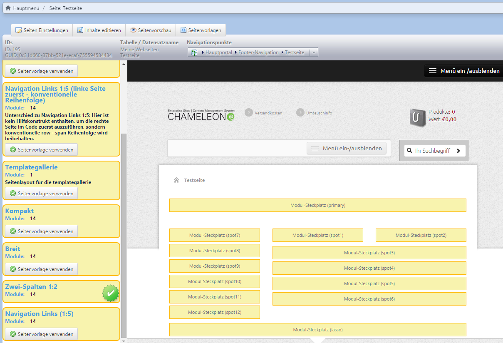

# Page Layout

~~Über ***Seitenvorlagen*** können Sie das gewählte Layout einer Seite jederzeit wechseln. Hier haben Sie die Möglichkeit, die verschiedenen Layouts anzusehen und das passende auszuwählen. In der linken Spalte sehen alle verfügbaren Layouts.~~

You can change the selected layout of a page at any time via ***Page Templates***. You can have a look at them and select the one you like. The available layouts are displayed in the left column of this page.

~~Dabei kann es sein, dass die Layouts eine unterschiedliche Anzahl an Modul-Spots haben. Das CMS übernimmt beim Wechsel des Layouts alle gleichnamigen Spots, so dass die vorher aktiven Module im neuen Layout entsprechend am neuen Platz des Modulspots wieder aktiv sind.~~

Thereby the layouts can include several numbers of module spots. In case of a change of a layout the CMS transfers all spots with the same name. So the modules which were active previously  will get active again on the new place of the module spot.

~~***Achtung***: Wenn das neue Layout allerdings weniger Spots hat als das vorherige, tauchen diese im neuen Layout nicht mehr auf. Wenn nun zurück auf das Layout mit mehreren Spots gewechselt wird, müssen die noch vorhandenen Module wieder neu zugeordnet werden.~~

**Please note**: If the new layout includes less spots, those won't be transferred to the new one. So if you get back to the previous layout including the several spots, the still existing modules should be rearranged. 

