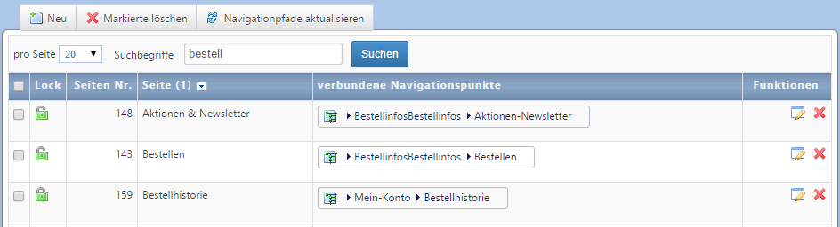

# Page management

Eine Liste aller *Seiten* wird über Seiten im Topmenü geladen. Alternativ kann die Liste über das Hauptmenü *Website → Meine Webseiten* geöffnet werden. Die Liste zeigt neben dem Namen der Seite auch den oder die zugewiesenen Navigationspunkte. Bitte beachten Sie, dass der Name der Seite nur im CMS verwendet wird. Auf der Webseite wird für den Namen der Seite der zugewiesene Hauptnavigationspunkt verwendet.

A list with every *page* is loaded from pages in the top menu. Alternatively you may open it via the main menu, *website -> My websites*.

Über den Button *Navigationspfade aktualisieren* wird der URL-Pfad-Cache für die Seiten aktualisiert. Da Cache-Einträge automatisch beim Speichern eines Navigationspunktes aktualisiert werden, ist diese Funktion nur dann notwendig, wenn der Navigationsbaum durch z.B. einen Import verändert wurde.

