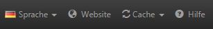
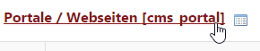

# Language / Website/ Cache / Support

~~* ***Sprache***: Bei multilingualen CMS/Shops hat man die Möglichkeit, während der Arbeit die Sprache zu wechseln, indem man auf „Editiersprache“ klickt und in der Auswahl die entsprechende Sprache wählt.
***Webseite***: öffnet das Frontend in einem neuen Browser-Tab.
***Cache***: Zwischenspeicher leeren von entweder a) Seiten-Cache leeren und b) Seiten- und Template-Cache leeren
***Hilfe***: öffnet eine Schnellreferenz aller Hilfetexte im System. Bei Einträgen mit diesem Zeichen können Sie direkt an die entsprechende Stelle im Backend springen.~~

* ***Language***: It is possible to change the language while editing a multilingual CMS / Shop via clicking "Editing Language" and selecting the relevant language.
* ***Website***: Opens the frontend in a new browser tab.
* ***Cache***: Empty Cache of either a) Empty page cache or b) Empty page and template cache
* ***Help***: Opens a quick reference of all supporting texts in the system. You get to the relevant sector in the backend directly via clicking the icon (if it is available).

