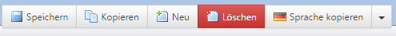
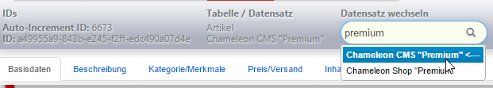

# Table / Data Set

~~Im oberen Bereich werden, wie in der Listenansicht, die verfügbaren Funktionen aufgeführt. Diese können auch jederzeit über das Rechtsklick-Menü im Datensatz erreicht werden.~~

Available functions are shown in the upper area (same like list view). You can also reach them via right-klick menu within the data set.

 

~~##### Speichern~~

##### Saving

~~Über den Button wird der aktuelle Stand der Daten in die Datenbank geschrieben. Sollten nicht alle Pflichtangaben ausgefüllt worden sein, wird der Speichervorgang mit einer entsprechenden Meldung unterbrochen (es werden also keine Daten gespeichert).~~

Via clicking the button the current status will be written to the database. In case of missing mandatory details the saving process will be interrupted by a corresponding message (therefore nothing will be saved).

 

~~##### Kopieren~~

##### Copy

~~Kopiert den aktuellen Datensatz *direkt aus der Datenbank*. Sollten also Änderungen gemacht worden sein, die noch nicht gespeichert wurden, dann sind diese Änderungen weder im Original-Datensatz noch in der Kopie enthalten.~~

The current data set will be copied *directly from the date base*. So if there are changes which haven't been saved, you wont get them back neither from the original data set nor in the copy.

 

~~##### Neu~~

##### New

Legt einen neuen, leeren Datensatz an.

Creates a new, empty data set.

~~**ACHTUNG**: Auch wenn Sie den Datensatz nicht befüllen und noch nicht gespeichert haben, ist dieser angelegt. Wenn Sie also versehentlich einen neuen Datensatz erstellt haben, löschen Sie ihn wieder. Ansonsten weist das Backend zahlreiche leere Datensätze auf (in der Listenansicht können Sie prüfen, ob leere Datensätze vorhanden sind).~~

**Please note:** Even no information has been defined or saved, the data set will be saved. If you have created a new data set accidentally, delete it! Otherwise the backend stores numerous empty data sets (you can prove it within the list view).

 

~~##### Löschen~~

##### Delete

Löscht den aktiven Datensatz. Nach dem Löschen landet der Benutzer wieder auf der Listenansicht der Tabelle.

The active data set will be deleted. Afterwards the user will get displayed the list view of the table.

 

~~##### Sprache kopieren~~

##### Copy the Language

~~Hier werden Felder, die in der aktuellen Sprache nicht übersetzt sind, aus der anderen Sprache kopiert.~~

At this point those text fields will be copied from another language, in case that they are not translated within the current language.

 

~~##### Datensatz wechseln~~

##### Change Data Set

~~Im oberen Bereich des Datensatzes steht ein Eingabefeld zur Verfügung über welches andere Datensätze aus der Datensatzliste geladen werden können. Angezeigt und durchsucht wird immer das Namensfeld der Datensätze.~~

You can find an input field in the upper section. You can use this one to load another data set from the data base. It is the name of the data set which is always been shown an searched for.

 

~~##### Datensatz Details~~

##### Data Set Details

~~Im oberen linken Bereich wird die ID des aktiven Datensatzes angezeigt. Dabei werden sowohl eine ID wie auch eine GUID (global unique identifier) aufgeführt. Bei der GUID handelt es sich entweder um die gleiche Nummer wie ID, oder um ein 36 Zeichen langen Identifier (je nachdem ob Komplexe ID Felder in den CMS-Einstellungen aktiviert wurden).~~

The ID of the active data set is shown in the left upper section. In this context it indicates both an ID and a GUID (global unique identifier). The GUID contains either the same number as the ID or an identifier with 36 characters (it depends on whether the complex ID boxes have been activated within the CMS or not).

~~Darauf folgt eine Liste aller Felder des Datensatzes. Neben manchen Feldern taucht Links neben dem Eingabefeld zusätzlich ein kleines Fragezeichen  auf - hinter diesem Symbol verbirgt sich ein Hilfe/Erklärungstext für das Feld. Der Text wird durch einen Klick auf das Symbol eingeblendet.~~

This is followed by a list which includes every single field of the data set. There is a little questionmark on the left to some input fields. Behind this there is a support and explanatory text for the relevant field. The text will be shown by clicking on it.

**Wichtig**: Bei manchen Feldern wird bei Editieren die Seite gewechselt. Da das System Änderungen nicht automatisch speichert, sollte der Benutze diese vorher durch ein Klick auf den *Speichern*-Button sichern.

Note that sometimes theres a change of the page while editing. The system does not save changes automatically, so the user should do that first by clicking the button.