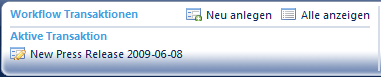
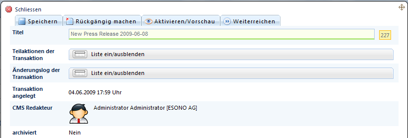
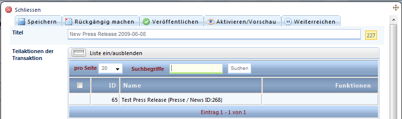
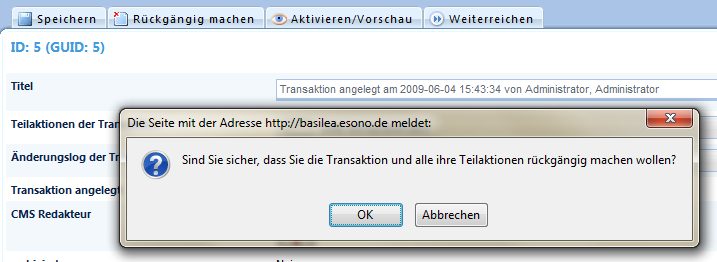

# Transaktionen

Bei aktiviertem Workflow und den passenden Rechten des CMS-Redakteurs erscheint im Backend-Header das Workflow-Menü:

Es wird automatisch eine Transaktion angelegt und ein Titel generiert.

Diesen sollten Sie auf einen aussagekräftigen **Titel ändern**, um anderen Redakteuren einen Überblick über die beinhalteten Änderungen zu geben. Klicken Sie dazu den Titel der aktiven Transaktion an. Es öffnet sich ein Fenster mit Detailinformationen zur Transaktion. 

<u>Hier erhalten Sie folgende Informationen:</u>

| Name | Beschreibung |
| -- | -- |
| **Titel** | Kann beliebig angepasst und durch „Speichern“ geändert werden |
| **Teilaktion der Transaktion** | Listet alle geänderten Datensätze mit ihren Aktionen auf (siehe nächste Abbildung) |
| **Änderungslog der Transaktion** | Listet alle „Bewegungen“ der Transaktion auf, z.B. Weiterreichung der Transaktion an einen Kollegen, Rückführung der Transaktion zur Fehlerkorrektur und anschließende Freigabe |
| **Transaktion angelegt** | Bevor man Änderungen vornimmt, sollte man eine Transaktion anlegen und passend betiteln. |
| **CMS Redakteur** | aktueller „Besitzer“ der Transaktion |
| **Archiviert** | gibt an, ob die Transaktion bereits veröffentlicht wurde und das Log nur noch zu Archivierungszwecken vorgehalten wird |

<u>Mögliche Funktionen bei Transaktionen (je nach Rechten des Redakteurs unterschiedlich):</u>

| Name | Beschreibung |
| -- | -- |
| **Speichern** | Titel ändern |
| **Rückgängig machen** | Es wird ein Rollback durchgeführt. Das bedeutet, dass alle Änderungen/Aktionen dieser Transaktion verworfen werden und die Transaktion danach gelöscht wird. |
| **Veröfffentlichen** | entfernt die Markierungen von neuen Datensätzen, löscht als solche markierte Datensätze und kopiert editierte Datensätze in die Live-Datenbanktabellen. |
| **Aktivieren / Vorschau** | um Änderungen einer Transaktion im Vorschaumodus auf der Website sehen zu können, kann diese hier aktiviert werden. Dabei wird der aktuelle Besitzer per E-Mail darüber informiert, dass die Transaktion von einer dritten Person übernommen wurde. |
| **Weiterreichen** | ermöglicht das Übertragen von Zuständigkeiten/einer Aufgabe an einen weiteren Redakteur, z.B. zur Korrektur oder auch als Freigabe-Anfrage. |
