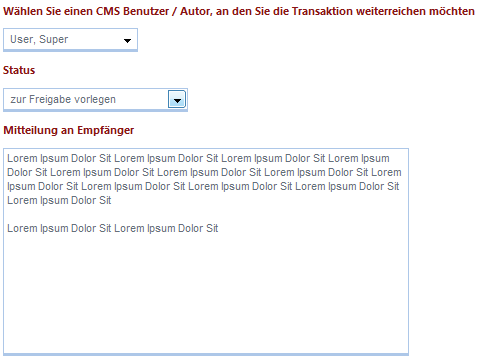
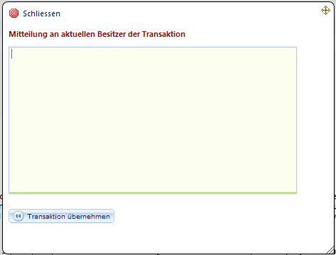

# Transaktionen weitergeben / übernehmen

Transaktionen können zwischen verschiedenen Redakteuren weitergereicht werden. Die Liste der Redakteure, die für eine Weiterreichung zur Auswahl stehen, ist auf die Personengruppe reduziert, die die passenden Gruppen- und Rollenrechte haben, alle zu einer Transaktion gehörenden Datensätze zu editieren. Entsprechend sollte man keine Änderungen an unterschiedlichen Teilen der Website bzw. modulübergreifend in einer Transaktion durchführen, sondern getrennte Transaktionen anlegen (z.B. Neue Pressemeldung in eine Transaktion und Änderungen an Job-Angeboten in eine andere Transaktion). 

Damit wird gewährleistet, dass es nicht passieren kann, dass eine Transaktion nur noch von einem „Super-User“ bearbeitet werden kann, weil er der einzige Benutzer ist, der die Rechte auf alle Teile der Transaktion hat.

Als „Weiterreichen“ gilt auch eine Freigabe-Anforderung. Es stehen verschiedene Status-Arten zur Deklarierung einer Weiterreichung zur Verfügung (diese können, wenn benötigt, ergänzt werden).

| Bezeichnung | Beschreibung |
| -- | -- |
| **zur Kontrolle** | Dieser Status kann verwendet werden, um anzugeben, dass die Änderungen nochmals Korrektur gelesen werden sollen und noch nicht zur Freigabe bereit sind. |
| **Zur Freigabe vorlegen** | Wenn Sie mit Ihren Änderungen fertig sind, können Sie damit die Veröffentlichung Ihrer Anpassungen bei einem Redakteur mit entsprechenden Rechten beantragen. |
| **Korrektur nötig** | Wenn Sie eine Transaktion zur Kontrolle weitergeleitet bekommen haben, können Sie diese mit diesem Status markieren, wenn Sie noch Fehler gefunden haben. Details zu den gefundenen Fehlern können Sie in das Kommentarfeld schreiben. Dieses wird mit in der Status-E-Mail übermittelt. |
| **(Urlaubs-) Vertretung** | Nutzen Sie diesen Status, um ihre Transaktion an einen Kollegen weiterzureichen, wenn Sie außer Haus sind und die Transaktion noch fertiggestellt werden muss. |
| **Projektübergabe / Stellvertreter** | Ähnlich der Urlaubsvertretung können Sie diesen Status wählen, um eine laufende Transaktion zur Beendigung durch einen Nachfolger zu markieren. |
| **Transaktionsbesitz übernehmen** | Wählen Sie diesen Status, wenn Sie eine Transaktion aktiv von z.B. einem Kollegen, der im Urlaub ist, übernehmen, um sie fertigzustellen oder zu prüfen. |
