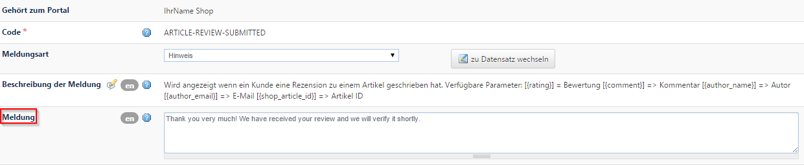

# Übersetzungen von Fehlermeldungen -> Portale / Webseiten

CMS / Portal-Einstellungen → Portale / Webseiten

Einige Systemmeldungen und Fehlercodes erscheinen auch im Frontend und sollten daher ebenfalls übersetzt werden (Feld ***Meldung***)

