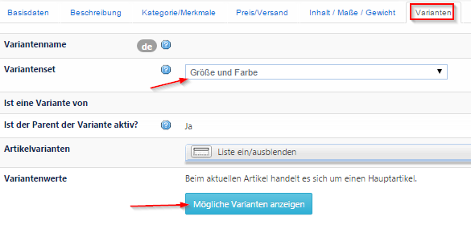
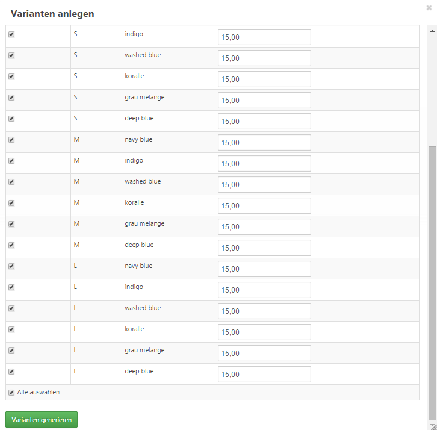
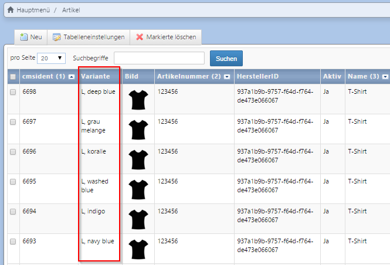
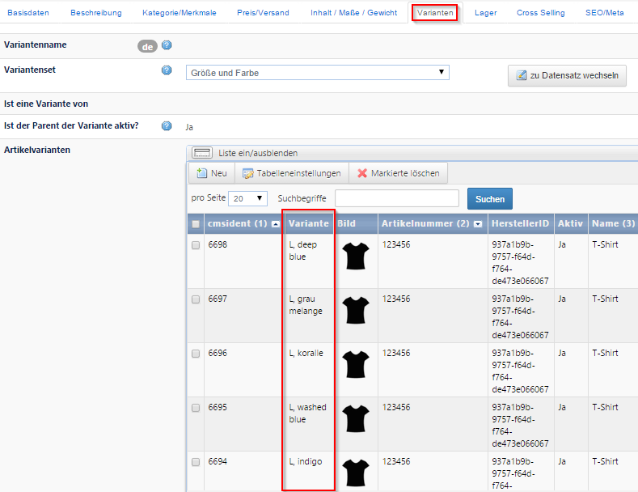
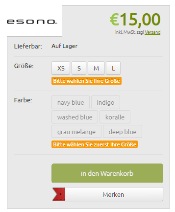

**# Varianten generieren

Nachdem Sie das Variantenset erstellt haben, können Sie nun die einzelnen Varianten des Hauptartikels (Parent) mithilfe des Variantengenerators anlegen. Gehen Sie beim Parent-Artikel (Artikel → Artikel) zum Tab Varianten und wählen Sie dort das entsprechende Variantenset aus dem Dropdown-Menü aus. 

Mit Klick auf den Button ***Mögliche Varianten*** anzeigen

erhalten Sie eine Matrix mit allen möglichen Kombinationen, die sich aus den Variantenarten und –werten ergeben. Wählen Sie aus den vorgeschlagenen Varianten die aus, die angelegt werden sollen, und klicken Sie auf ***Varianten generieren***.

,

Die erzeugten Varianten werden Ihnen sowohl in der Artikelübersicht (Artikel → Artikel) angezeigt,

als auch direkt beim Parent-Artikel im Tab Varianten → Artikelvarianten.

Im Frontend wird der Artikel auf der Produktdetailseite mit den auswählbaren Varianten angezeigt:

<u>Hinweis</u>: Der Hauptartikel eines Variantensets kann nicht gekauft werden – ein Kunde muss also immer eine Variante wählen. Um Sortierung nach Preisen, Beliebtheit usw. sinnvoll durchführen zu können, werden folgende Felder der Varianten vom System automatisch summiert und beim Hauptartikel hinterlegt:
1. Preis
2. Lagerbestand

Sobald eine Variante aktiviert wird, wird automatisch auch der Parentartikel aktiv geschalten (sofern dieser vorher inaktiv war). 
