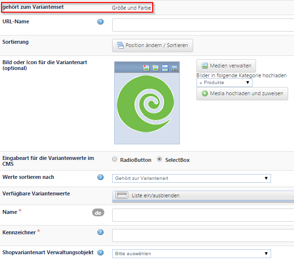
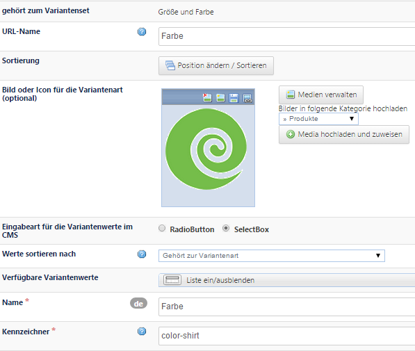

# Variantenarten anlegen

Mit Klick auf ***Neu*** verlassen Sie das angelegte *Variantenset* und gelangen zu einer neuen Maske. Die Zugehörigkeit zum Set *Größe und Farbe* wird in der ersten Zeile angezeigt.

Füllen Sie zunächst die Pflichtfelder (durch * gekennzeichnet) aus:

* ***Name*** der Variantenart: Tragen Sie hier den Namen der Variantenart ein, wie es im Onlineshop auf der Produktdetailseite angezeigt werden soll (*Größe*)
* ***Kennzeichner*** der Variantenart: Dieser Wert wird vom System benötigt. Tragen Sie hier den englischen Name der Variantenart ein, dieser Begriff muss eindeutig sein. 
<u>Hinweis</u>: Die Begriffe *size* und *color* werden vom System auch für den Filter verwendet. Soll nach Größen und Farben gefiltert werden, verwenden Sie für den Kennzeichener der Variantenart diese Begriffe. 

SPEICHERN

* ***Verfügbare Variantenwerte***: Erstellen Sie hier die Werte der Variante, in diesem Beispiel alle Größen und Farben, in denen das T-Shirt verkäuflich ist, sh. nächster Abschnitt.

