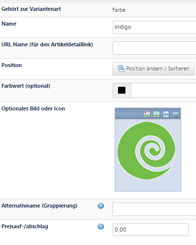
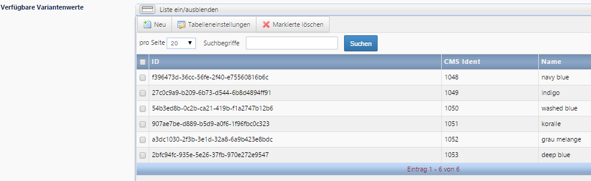

# Variantenwerte anlegen

Mit Klick auf NEU verlassen Sie jetzt die angelegte *Variantenart* und gelangen zu einer neuen Maske. Die Zugehörigkeit zur Variantenart *Farbe* wird in der ersten Zeile angezeigt.
* **Name** des Variantenwerts: Tragen Sie den Wert der Variante ein, z.B. bei Farben den Wert indigo1

Die weiteren Felder in dieser Maske wie z.B. ***Preisauf-/abschlag***** füllen Sie nach Bedarf aus.

1: Soll im Frontend nach Variantenwerten gefiltert werden, empfiehlt es sich, bei vielen ähnlichen Werten, wie z.B. verschiedenen Schattierungen eines Farbtons (blau: *navy blue, washed blue, indigo, …*), systemweite Produktattribute (Hauptmenü → Artikel → Produktattribute) anzulegen. Bei Farben würde man z.B. ein Set mit den Hauptfarben (gelb, rot, blau, …) anlegen. Diese Attribute werden beim Hauptartikel im Tab „Kategorie/Merkmale“ verknüpft, im aktuellen Beispiel also das Attribut *blau*. Filtert man nun im Frontend nach der Farbe *blau*, so wird in den Ergebnissen der Hauptartikel mit der Variante *indigo* angezeigt.

Wenn Sie einen Variantenwert gespeichert haben, können Sie gleich mit Klick auf NEU den nächsten Wert anlegen, Sie müssen nicht zurück in die Maske Variantenart gehen.

Die Variantenwerte können mit einem Namen, einem Bild, und einem Farbwert versehen werden. 

Legen Sie so alle benötigten Variantenarten mit den dazugehörigen Variantenwerten an. Angelegte Variantenarten mit den dazugehörigen Werten werden automatisch unter Artikel → Shop-Artikelvarianten abgelegt.

Beachten Sie, dass die bei den Variantenarten hinterlegten Werte je Variantenset unabhängig voneinander sind, da die Werte einer Variantenart oder eines Sets im System eindeutig zuordenbar sein müssen. Wenn Sie z.B. 10 Farben bereits für eine Variantenart verwendet haben, müssen Sie diese Farben für ein weiteres Variantenset neu anlegen (dabei dürfen Sie natürlich die gleichen Farben verwenden). 