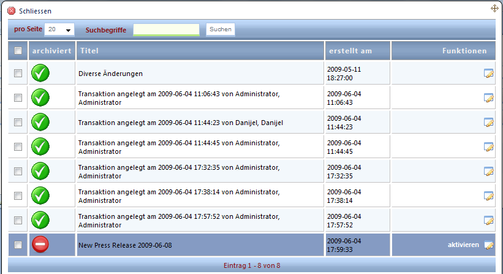
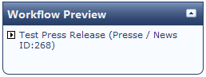

# Vorschau

Sie haben jederzeit die Möglichkeit, die Darstellung ihrer Änderungen im Live-System zu überprüfen. Dabei ist es immer nur möglich, die Änderungen einer Transaktion für die Vorschau zu aktivieren, nicht mehrere (dies ist für spätere CHAMELEON-Versionen geplant). Es wird immer die gerade aktuelle Transaktion (ersichtlich im Header des CMS) in der Live-Website als Vorschau dargestellt. Um eine andere Transaktion sehen zu können, müssen Sie diese vorher aktivieren - entweder über den Button „**Transaktion übernehmen**“ in einem Datensatz oder über „**Alle anzeigen**“ in der Workflow-Box im CMS-Header und Klicken auf das „**aktivieren**“-Icon.

Während eine Transaktion für eine Vorschau aktiviert ist, wird Ihnen dies durch einen eingeblendeten Layer in der rechten oberen Ecke auf der Live Website kenntlich gemacht. Beachten Sie, dass Sie dazu im CMS angemeldet sein müssen.

Hier können Sie auch auf einen Blick sehen, welche Änderungen Teil der Vorschau sind und somit von der aktuellen Live-Darstellung abweichen.